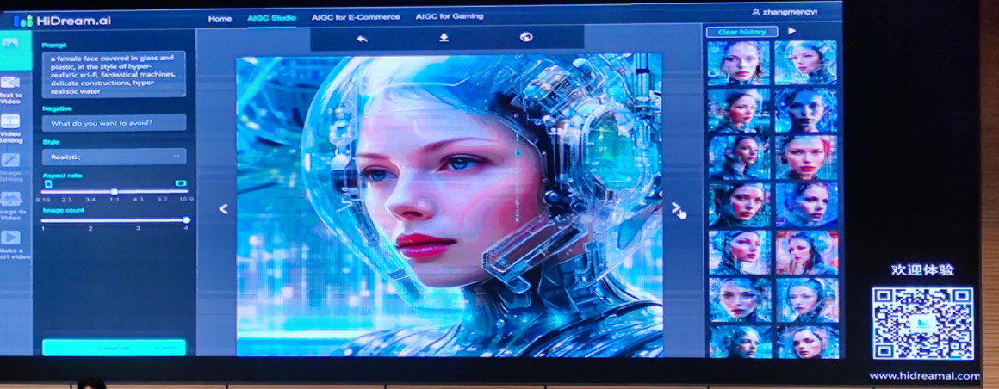
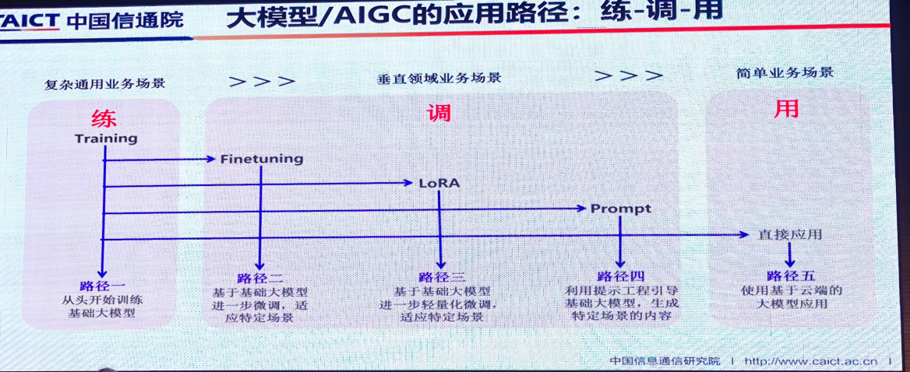
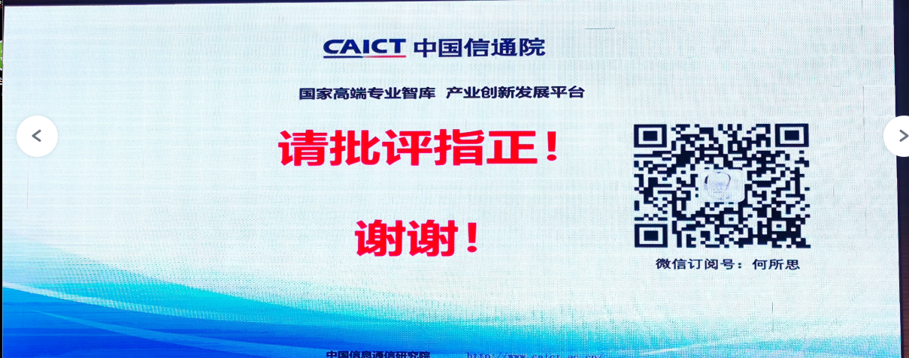
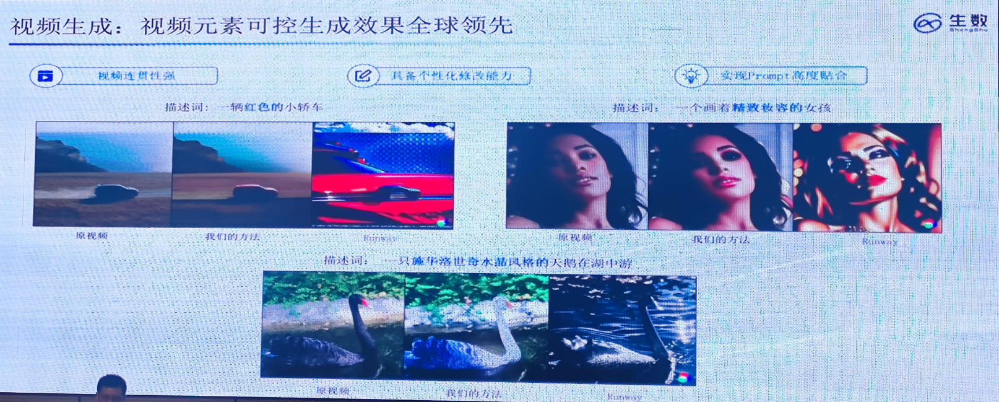
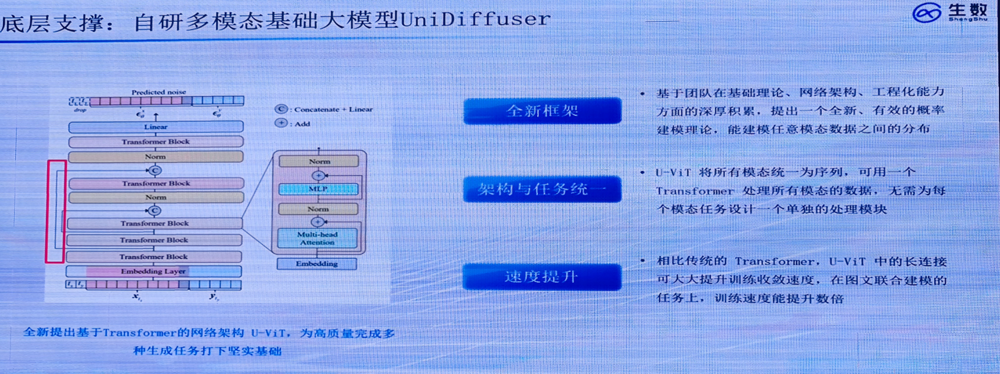
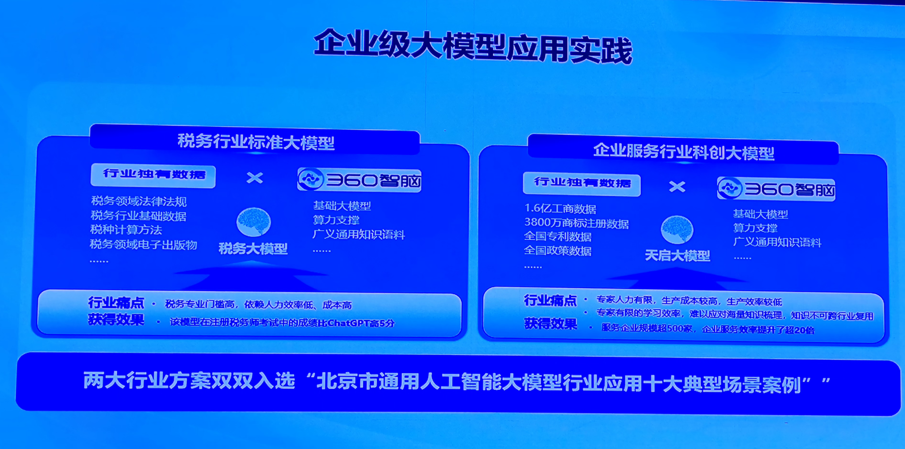
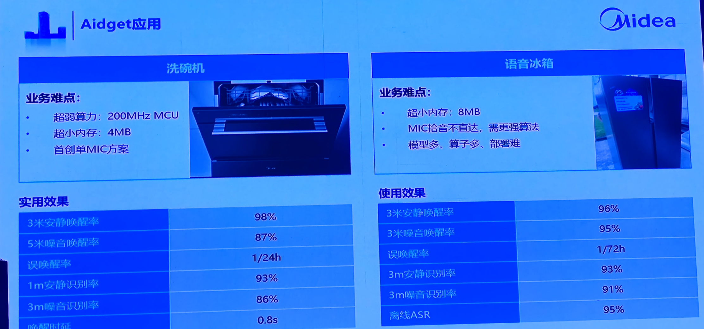

# 摩科智能服贸会aigc论坛学习

​		2023年9月4日-6日参加北京服贸会，在会上主要听取了aigc相关的汇报，下面就比较优秀的干货进行整理和前沿要点梳理，梳理的内容包括两个维度：汇报要点整理和aigc前沿信息汇总，最后根据前两个内容，写一下摩科智能从算法层面未来半年到一年需要做哪些工作。

## 一、ppt要点整理

### 1.1、智象未来

​		智象未来，一家专注于构建视觉多模态基础模型及应用的生成式人工智能初创公司，由加拿大工程院外籍院士、原京东集团副总裁梅涛博士创立。

智象未来的业务主要涉及文、图、音频和视频等多模态，通过foundation model 实现文生图，图片生成视频，文本生成视频等等。

这是用于多模态aigc面临的三大挑战，就是将文本，图片和视频编码，通过cross-model  找到三者的相关性，最后通过解码输出对应的内容，比如文本，图片和视频。

目前，aigc多模态面临的难点主要存在上图框选的内容，我们采用文本生成对应的图片往往在细节上处理的不是很理想，这一块还需要进一步探索。

多模态模型发展历程介绍，尤其是扩散模型的发展加速了多模态的发展。

大于100亿参数大模型能够支持以下的工作，比如文字生图，图像编辑，图像生成视频，文字生成视频，视频编辑和图像和视频生成文字等。

基础多模态模型包括vision transformer encoder 、unified multimodality model 和memory augmented decoder三个部分。

示例展示，还有视频的这里可用参考链接。

这是他们开源的文本生成图片的项目，可用在github上能够找到，这里主要介绍了该模型与其他模型相比的验证效果。

这是文本生成图片的示例，图片左侧可用看到输入对应的文本描述，模型可用按照对应的描述生成对应的图片，人工可选取对应的图片，体验二维码在右下方。

### 1.2、中国联通

随着aigc的发展，现在比较关注的是大模型内容安全性，算法安全性，数据安全性和网络安全性等，这一块都需要通信业基于算网一体化智算基础设施。

以上就是联通自己的一些产品介绍，主要跟多模态技术和数字人技术相关。

### 1.3、达观数据

​		达观数据是一家为企业提供各类场景文本机器人的人工智能企业。达观智能文本机器人深度集成[自然语言处理](https://baike.baidu.com/item/自然语言处理/365730?fromModule=lemma_inlink)（NLP）、光学字符识别（OCR）、机器人流程自动化（RPA）和知识图谱等各类技术，结合企业业务场景提供高效便捷可控的文本机器人产品和解决方案。

目前文档处理面临的困难在于板式复杂，文字理解难度困难。主要的难题有以下几个：文件格式有很多种，复杂结构元素和跨文档复杂关系等。

针对上述的痛点问题，达观数据自研了版面分析技术。

​		让我印象最深刻的是为什么选择曹植作为大模型的名称，演讲者给出的理由是：曹植是我国著名的文学家，曾经写过长达千字的《洛神赋》，他们希望自己的模型想曹植一样有才华，能够实现长文本生成。

​		曹植大模型最大的特点就是采用混合语料和垂直语料按照1：1的比例进行预训练，然后采用多模型并联的架构进行融合，融合行业知识图谱，最大程度增加aigc的能力。

曹植大模型应用的场景介绍，包括自动阅读和自动写作两大类。

​		上述几张图片主要讲解曹植大模型的企业定制方案，主要想通过企业级垂直领域数据微调实现长文本，多语言的文本生成，辅助人工业务办理。

### 1.4、中国信通院

### 1.5、星环科技

​		星环科技致力于打造企业级大数据基础软件，围绕数据的集成、存储、治理、建模、分析、挖掘和流通等数据全生命周期提供基础软件与服务，构建明日数据世界。

目前垂直领域大模型的主要应用方向包括领域数据微调和词嵌入用于数据库检索。

我感觉这个图挺重要的的，后续会把它重新画一下，这里涉及垂直领域的大模型微调和应用的方案介绍。

### 1.6、澜舟科技

### 1.7、生数

### 1.8、openi启智

### 1.9、360智脑

### 1.10、美的

## 二、aigc前沿探索结论

​		（1）对于aigc的前沿探索最大难点在于如何保证大模型能够安全、有效和可控地输出，只有解决这些难题才能保证大模型真正进入市场应用。

​		（2）从这两天的汇报中，各行各业都在积极往大模型靠拢。有些公司正在从自研大模型构建闭环生态，也有些公司，他们采用to B业务数据集与通识数据集，混合制作垂直领域大模型。这些公司大多对于领域数据集都有着几年或者几十年的积累，他们不论是自研还是微调获得的大模型，能够很轻松地解决数据规模和数据质量的问题。这些公司将制作完成的大模型通过提供api接口 、或直接提供大模型赋能的产品等形式进行变现。

​		（3）大模型制作 agent，可用于解决实际业务难题。比如采用[langchain](https://baijiahao.baidu.com/s?id=1771181070089734700&wfr=spider&for=pc)或[*LlamaIndex*](https://zhuanlan.zhihu.com/p/638827267)等工具，将大模型用于本地知识库检索问答和业务推理等，或者采用[ChatGPT-Next-Web ](https://zhuanlan.zhihu.com/p/647597910)接入gpt3.5/4.0 api key 制成供员工访问的免翻墙平台，目的在于提高业务办公效率等。

​		（4）对于大模型生成，由于其幻觉和地区法律等因素制约，不建议直接采用大模型生成内容用于生产中。如果一定要大模型的生成能力，则需要人工审核，确定安全后才能进行使用，否则企业产品会面临一定风险。我们也可以用大模型生成的稠密词向量的能力，直接用于faq或超长文本检索等。

​		（5）对于数字人，它与大模型分属两个不同的赛道，也可以使用大模型对其语音识别，问答和机械工作进行赋能，这一部分还需要进一步深入研究。

​       （6）报告中有些分享涉及研发的大致方案和架构设计，可用进行进一步整理和修改，使其能够直接用工作中，后续整理。

​		