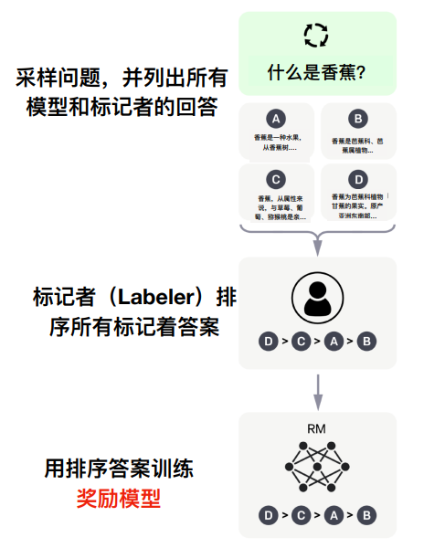

# 													大语言模型追踪

## 一、chatgpt

​		chatgpt训练过程分为三个阶段，分别为训练监督策略模型、训练奖励模型和采用ppo强化学习来优化策略。

### 1.1、**训练监督策略模型**

​		为了让GPT 3.5初步具备理解指令的意图，首先会在数据集中随机抽取问题，由人类标注人员，给出高质量答案，然后用这些人工标注好的数据来微调 GPT-3.5模型（获得SFT模型, Supervised Fine-Tuning）。此时的SFT模型在遵循指令/对话方面已经优于 GPT-3，但不一定符合人类偏好。

### 1.2、训练奖励模型（Reward Mode，RM）

​		这个阶段的主要是通过人工标注训练数据（约33K个数据），来训练回报模型。在数据集中随机抽取问题，使用第一阶段生成的模型，对于每个问题，生成多个不同的回答。人类标注者对这些结果综合考虑给出排名顺序。这一过程类似于教练或老师辅导。接下来，使用这个排序结果数据来训练奖励模型。对多个排序结果，两两组合，形成多个训练数据对。RM模型接受一个输入，给出评价回答质量的分数。这样，对于一对训练数据，调节参数使得高质量回答的打分比低质量的打分要高。

### 1.3、采用PPO（Proximal Policy Optimization，近端策略优化）强化学习来优化策略

​		PPO的核心思路在于将Policy Gradient中On-policy的训练过程转化为Off-policy，即将在线学习转化为离线学习，这个转化过程被称之为Importance Sampling。这一阶段利用第二阶段训练好的奖励模型，靠奖励打分来更新预训练模型参数。在数据集中随机抽取问题，使用PPO模型生成回答，并用上一阶段训练好的RM模型给出质量分数。把回报分数依次传递，由此产生策略梯度，通过强化学习的方式以更新PPO模型参数。如果我们不断重复第二和第三阶段，通过迭代，会训练出更高质量的ChatGPT模型。

## 二、ChatGPT的技术架构

​		ChatGPT之前有几个知名的兄弟，包括GPT-1、GPT-2和GPT-3。这几个兄弟一个比一个个头大，ChatGPT与GPT-3更为相近。

## 三、大模型模型训练框架

​		大模型在整个训练过程中，SFT微调、RM/RBRM训练和PPO强化学习这三个阶段是相辅相成的。首先，通过SFT微调使模型适应特定任务，然后使用RM或RBRM训练来设计合适的奖励函数，最后应用PPO强化学习算法进一步优化模型策略。这种训练方法的一个关键优势是，它可以将人类专家的知识和偏好引入模型中。通过微调和基于奖励的方法，模型可以学会生成符合人类期望的输出。最后输入的内容需要充分考虑人类的价值观，做到真正理解用户需求、遵循道德和法律规范、适应社会和文化背景和防止有害输出。

### 3.1、基座预训练（Base pretrain）

​		预训练模型的目的是让模型学习到语言的基本结构、语法规则和一般知识，从而为后续的任务定向训练打下基础。在预训练阶段，模型在大量无标注文本数据上进行训练，学习到语言的基本知识和潜在规律。预训练后的模型就是所谓的基座。

### 3.2、SFT微调（Supervised Fine-Tuning）

​		SFT微调是指对预先训练好的大型语言模型（如GPT系列）进行监督式微调。通过使用大量的人工标注数据，根据特定任务需求，进一步优化模型的性能。这些数据通常包括输入与对应的期望输出，让模型学会如何从输入得出正确的输出。微调的过程可以看作是在原始预训练模型的基础上，为其适应特定任务场景而进行的“个性化训练”。

### 3.3、奖励函数训练（Reward Modeling, RM）

​		RM训练是指为强化学习任务设计奖励函数。奖励函数是一个用于评估AI智能体在特定任务中表现的度量，引导智能体在学习过程中采取正确的行动。RBRM是一种基于排序的奖励建模方法，通过对多个候选输出进行人工排序，为输出赋予相对优劣，从而指导模型生成更好的回答。这种方法可以帮助解决常规奖励建模方法在一些情况下难以为模型提供足够明确指导的问题。

### 3.4、基于人类反馈的强化学习（RLHF）

​		PPO（Proximal Policy Optimization），即近端策略优化方法，是一种强化学习算法，通过优化模型的策略（即在给定输入时选择动作的方式）来提高模型性能。在基于RM或RBRM的PPO训练中，模型利用设计好的奖励函数（或基于排序的奖励模型）来学习如何为特定任务生成更好的输出。通过与环境交互并获取奖励信号，模型不断调整自身策略，以便在未来的相似任务中获得更高的奖励。PPO算法的优势在于其能够在保持稳定性的同时实现较高的性能。

### 3.5、与人类对齐（Align AI with human values）

​		大语言模型的与人类对齐是指让人工智能模型理解、遵循并适应人类的价值观、需求和期望。这意味着让模型在处理各种任务时，不仅要提供准确和有帮助的信息，还要确保所生成的内容遵循道德、法律和社会规范，避免产生有害或误导性的结果。

与人类对齐的过程通常包括以下几个方面：

1. 理解用户需求：让模型更好地理解用户在不同场景下的真实需求，以便生成有针对性和相关性的回答。
2. 遵循道德和法律规范：确保模型生成的内容符合道德和法律规定，避免侵犯隐私、传播虚假信息或煽动仇恨等行为。
3. 适应社会和文化背景：让模型了解并尊重不同社会和文化背景，以避免产生冒犯、歧视或误解的内容。
4. 防止有害输出：在模型生成内容时警惕并避免潜在的有害信息，确保输出无害且有益。

## 四、[ChatGPT开源平替](https://github.com/chenking2020/FindTheChatGPTer)

        该类方法主要采用非LLAMA等微调方式，自主设计或者优化GPT、T5模型，并实现从预训练、监督微调、强化学习等全周期过程。

### 4.1、ChatYuan

        ChatYuan（元语AI）是由元语智能开发团队开发和发布的，自称第一个国内最早的一个功能型对话大模型，可以写文章、写作业、写诗歌、做中英文间的翻译；一些法律等特定领域问题也可以提供相关信息。该模型目前只支持中文，开源项目地址：[ChatYuan](https://github.com/clue-ai/ChatYuan)

        从披露的技术细节看，底层采用7亿参数规模的T5模型，并基于PromptClue进行了监督微调形成了ChatYuan。该模型基本上是ChatGPT技术路线的三步的第一步，没有实现奖励模型训练和PPO强化学习训练。

### 4.2、Colossal AI

        最近，ColossalAI开源了他们的ChatGPT实现。分享了他们的三步策略，完整实现了ChatGPT核心的技术路线：其Github如下： [ColossalAI](https://github.com/hpcaitech/ColossalAI)

        本人基于该项目，更加明确了三步策略，并进行了分享：

        第一阶段（stage1_sft.py）：SFT监督微调阶段，该开源项目没有实现，这个比较简单，因为ColossalAI无缝支持Huggingface，本人直接用Huggingface的Trainer函数几行代码轻松实现，在这里我用了一个gpt2模型，从其实现上看，其支持GPT2、OPT和BLOOM模型；

        第二阶段（stage2_rm.py）：奖励模型（RM）训练阶段，即项目Examples里train_reward_model.py部分；

        第三阶段（stage3_ppo.py）：强化学习（RLHF）阶段，即项目train_prompts.py

        三个文件的执行需要放在ColossalAI项目中，其中代码中的cores即原始工程中的chatgpt，cores.nn在原始工程中变成了chatgpt.models

### 4.3、ChatGLM

        ChatGLM是清华技术成果转化的公司智谱AI开源的GLM系列的对话模型，支持中英两个语种，目前开源了其62亿参数量的模型。其继承了GLM之前的优势，在模型架构上进行了优化，从而使得部署和应用门槛变低，实现大模型在消费级显卡上的推理应用。 ChatGLM-6B开源地址为：[ChatGLM-6B](https://github.com/THUDM/ChatGLM-6B)

        从技术路线上看，其实现了ChatGPT强化学习人类对齐策略，使得生成效果更佳贴近人类价值，其目前能力域主要包括自我认知、提纲写作、文案写作、邮件写作助手、信息抽取、角色扮演、评论比较、旅游建议等，目前其已经开发了正在内测的1300亿的超大模型，算是目前开源平替里面参数规模较大的对话大模型。 VisualGLM-6B（更新于2023年5月19日）

        该团队近期开源了ChatGLM-6B的多模态版，支持图像、中文和英文的多模态对话。语言模型部分采用ChatGLM-6B，图像部分通过训练BLIP2-Qformer构建起视觉模型与语言模型的桥梁，整体模型共78亿参数。VisualGLM-6B依靠来自于CogView数据集的30M高质量中文图文对，与300M经过筛选的英文图文对进行预训练，中英文权重相同。该训练方式较好地将视觉信息对齐到ChatGLM的语义空间；之后的微调阶段，模型在长视觉问答数据上训练，以生成符合人类偏好的答案。 VisualGLM-6B开源地址为：[VisualGLM-6B](https://github.com/THUDM/VisualGLM-6B)，ChatGLM2-6B（更新于2023年6月27日）

        该团队近期开源了ChatGLM的二代版本ChatGLM2-6B，相对第一代版本，其主要特性包括采用了更大的数据规模，从1T提升到1.4T；最突出的莫过于其更长的上下文支持，从2K扩展到了32K，允许更长和更高轮次的输入；另外起大幅优化了推理速度，提升了42%，占用的显存资源也大幅降低。ChatGLM2-6B开源地址为：[ChatGLM2-6B](https://github.com/THUDM/ChatGLM2-6B)

### 4.4、PaLM-rlhf-pytorch

        其号称首个开源ChatGPT平替项目，其基本思路是基于谷歌语言大模型PaLM架构，以及使用从人类反馈中强化学习的方法（RLHF）。PaLM是谷歌在今年4月发布的5400亿参数全能大模型，基于Pathways系统训练。其可以完成写代码、聊天、语言理解等任务，并且在大多数任务上具有强大的少样本学习性能。同时采用了ChatGPT一样的强化学习机制，能让AI的回答更加符合情景要求，降低模型毒性。Github地址为：[PaLM-rlhf-pytorch](https://github.com/lucidrains/PaLM-rlhf-pytorch)

### 4.5、GPTrillion 

        该项目号称开源的最大规模模型，高达1.5万亿，且是多模态的模型。其能力域包括自然语言理解、机器翻译、智能问答、情感分析和图文匹配等。其开源地址为：[GPTrillion](https://huggingface.co/banana-dev/GPTrillion)，2023年5月24日，该项目是愚人节玩笑节目，项目已删除，特此说明。

### 4.6、OpenFlamingo

        OpenFlamingo是一个对标GPT-4、支持大型多模态模型训练和评估的框架，由非盈利机构LAION重磅开源发布，其是对DeepMind的Flamingo模型的复现。目前开源的是其基于LLaMA的 OpenFlamingo-9B模型。Flamingo模型在包含交错文本和图像的大规模网络语料库上进行训练，具备上下文少样本学习能力。OpenFlamingo实现了原始Flamingo中提出的相同架构，在一个新的多模态C4数据集的5M样本和LAION-2B的10M样本上训练而来。开源地址：[open_flamingo](https://github.com/mlfoundations/open_flamingo)

### 4.7、MOSS （更新于2023年4月21日）

        今年2月21日，复旦大学发布了MOSS，并开放公测，在公测崩溃后引起一些争议。现在该项目迎来重要更新和开源。开源的MOSS支持中英两个语种，且支持插件化，如解方程、搜索等。参数量大16B，在约七千亿中英文以及代码单词上预训练得到，后续经过对话指令微调、插件增强学习和人类偏好训练具备多轮对话能力及使用多种插件的能力。该项目的开源地址是：[MOSS](https://github.com/OpenLMLab/MOSS)

### 4.8、mPLUG-Owl （更新于2023年5月7日）

        与miniGPT-4、LLaVA类似，其是一个对标GPT-4的开源多模态大模型，其延续了mPLUG系列的模块化训练思想。其目前开源了7B参数量的模型，同时第一次针对视觉相关的指令理解提出一个全⾯的测试集 OwlEval，通过人工评测对比了已有模型，包括LLaVA、MiniGPT-4等工作，其展示出更优的多模态能力，尤其在多模态指令理解能力、多轮对话能力、知识推理能力等方⾯表现突出。目前遗憾的是跟其他图文大模型一样，仍然只支持英文，但中文版已在其待开源List中。开源地址是：[mPLUG-Owl](https://github.com/X-PLUG/mPLUG-Owl)

### 4.9、PandaLM （更新于2023年5月9日）

        PandaLM是一个模型评估大模型，旨在对其他大模型生成内容的偏好进行自动评价，节省人工评估成本。PandaLM自带有Web界面进行分析，同时还支持Python代码调用，仅用三行代码即可对任意模型和数据生成的文本评估，使用很方便。开源地址是：[PandaLM](https://github.com/WeOpenML/PandaLM)

### 4.10、悟道·天鹰 （更新于2023年6月12日）

        在近期召开的智源大会上，智源研究院开源了其悟道·天鹰大模型，具备中英双语知识。开源版本的基础模型参数量包括70亿和330亿，同时其开源了AquilaChat对话模型和quilaCode文本-代码生成模型，且都已经开放了商业许可。Aquila采用GPT-3、LLaMA等Decoder-only架构，同时针对中英双语更新了词表，并采用其加速训练方法。其性能上的保障不仅依赖于模型的优化改进，还得益于智源这几年在大模型高质量数据上的积累。开源地址是：[Aquila](https://github.com/FlagAI-Open/FlagAI/tree/master/examples/Aquila)

### 4.11、CoDi（更新于2023年6月12日）

        近期，微软重磅发表多模态大模型论文和开源代码-CoDi，彻底打通文本-语音-图像-视频，支持任意输入，任意模态输出。为了达到任意模态的生成，研究者将训练分为两个阶段，第一个阶段作者利用桥接对齐策略，组合条件进行训练，给每个模态都打造一个潜在扩散模型；第二个阶段给每个潜在扩散模型和环境编码器上增加一个交叉注意力模块，就能将潜在扩散模型的潜变量投射到共享空间中，使得生成的模态也进一步多样化。开源地址是：[i-Code-V3](https://github.com/microsoft/i-Code/tree/main/i-Code-V3)

### 4.12、ImageBind（更新于2023年6月12日）

        Meta重磅推出和开源其多模态大模型ImageBind，可以实现跨6种模态，包括图像、视频、音频、深度、热量和空间运动，ImageBind通过使用图像的绑定特性，利用大型视觉语言模型和零样本能力扩展到新的模态来解决对齐问题。图像配对数据足以将这六种模态绑定在一起，允许不同的模式彼此打通模态割裂。开源地址是：[ImageBind](https://github.com/facebookresearch/ImageBind)

### 4.13、baichuan-7B（更新于2023年6月15日）

        2023年4月10日，王小川官宣创办AI大模型公司“百川智能”，旨在打造中国版的OpenAI。在成立了两个月后，百川智能重磅开源其自主研发的baichuan-7B模型，支持中英文。baichuan-7B不仅在C-Eval、AGIEval和Gaokao中文权威评测榜单上，以显著优势全面超过了ChatGLM-6B等其他大模型，并且在MMLU英文权威评测榜单上，大幅领先LLaMA-7B。该模型在高质量数据上达到万亿token规模，并基于高效的attention算子优化支持上万超长动态窗口的扩张能力，目前开源支持4K上下文能力。该开源模型可以商用，比LLaMA更加友好。开源地址：[baichuan-7B](https://github.com/baichuan-inc/baichuan-7B)

### 4.14、XVERSE-13B（更新于2023年8月8日）

        2023年8月6日，元象XVERSE团队开源XVERSE-13B模型，该模型是一个多语言大模型，支持语种多达40+，支持上下文语境长度达8192，根据团队介绍，该模型特点有：模型结构：XVERSE-13B使用主流Decoder-only的标准Transformer结构，支持8K的上下文长度，为同尺寸模型中最长，能满足更长的多轮对话、知识问答与摘要等需求；训练数据：构建了 1.4 万亿 token 的高质量、多样化的数据对模型进行充分训练，包含中、英、俄、西等 40 多种语言，通过精细化设置不同类型数据的采样比例，使得中英两种语言表现优异，也能兼顾其他语言效果；分词：基于BPE算法，使用上百GB语料训练了一个词表大小为100,278的分词器，能够同时支持多语言，而无需额外扩展词表；训练框架：自主研发多项关键技术，包括高效算子、显存优化、并行调度策略、数据-计算-通信重叠、平台和框架协同等，让训练效率更高，模型稳定性强，在千卡集群上的峰值算力利用率可达到58.5%，位居业界前列。开源地址：[XVERSE-13B](https://github.com/xverse-ai/XVERSE-13B)

### 4.15、通义千问Qwen-7B（更新于2023年8月8日）

        2023年8月3日，阿里通义千问70亿模型开源，包括通用模型和对话模型，并且开源、免费、可商用。据介绍，Qwen-7B是基于Transformer的大语言模型，在超大规模预训练数据上训练得到。预训练数据类型多样，覆盖广泛，包括大量网络文本、专业书籍、代码等。它是支持中、英等多种语言的基座模型，在超过2万亿token数据集上训练，上下文窗口长度达到8k。Qwen-7B-Chat是基于Qwen-7B基座模型的中英文对话模型。通义千问7B预训练模型在多个权威基准测评中表现出色，中英文能力远超国内外同等规模开源模型，部分能力甚至超过了12B、13B大小的开源模型。开源地址：[Qwen-7B](https://github.com/QwenLM/Qwen-7B)

## 五、Alpaca系列篇

        LLaMA是由Meta发布的全新人工智能大型语言模型，在生成文本、对话、总结书面材料、证明数学定理或预测蛋白质结构等任务上方面表现良好。LLaMA模型支持20种语言，包括拉丁语和西里尔字母语言，目前看原始模型并不支持中文。可以说LLaMA的史诗级泄露大力推进了类ChatGPT的开源发展。

        （更新于2023年4月22日）但遗憾的是目前LLama的授权比较有限，只能用作科研，不允许做商用。为了解决商用完全开源问题，RedPajama项目应运而生，其旨在创建一个完全开源的LLaMA复制品，可用于商业应用，并为研究提供更透明的流程。完整的RedPajama包括了1.2万亿token的数据集，其下一步将着手开始进行大规模训练。这项工作还是非常值得期待，其开源地址是： [更新于2023年5月7日]( https://github.com/togethercomputer/RedPajama-Data)

        RedPajama更新了其训练模型文件，包括3B和7B两个参数量，其中3B可以在5年前发售的RTX2070游戏显卡上运行，弥补了LLaMa在3B上的空白。其模型地址为：[togethercomputer](https://huggingface.co/togethercomputer)

        除了RedPajama，MosaicML推出MPT系列模型，其训练数据采用了RedPajama的数据，在各类性能评估中，7B模型与原版LLaMA旗鼓相当。其模型开源地址为：[mosaicml](https://huggingface.co/mosaicml)

        无论是RedPajama还是MPT，其同时也开源了对应的Chat版模型，这两个模型的开源为类ChatGPT商业化带来了巨大的推动。模型更新于2023年6月1日。

        Falcon是对标LLaMA的有一个开放大模型底座，其拥有7B和40B两个参数量尺度，40B的性能号称超高65B的LLaMA。据了解，Falcon仍然采用GPT式的自回归解码器模型，但其在数据上下了大功夫，从公网上抓取内容构建好初始预训练数据集后，再使用CommonCrawl转储，进行大量过滤并进行大规模去重，最终得到一个由近5万亿个token组成的庞大预训练数据集。同时又加进了很多精选语料，包括研究论文和社交媒体对话等内容。但该项目的授权饱受争议，采用"半商业化"授权方式，在收益达到100万后开始有10%的商业费用。 该项目开源地址是：[更新于2023年7月3日](https://huggingface.co/tiiuae)

        原始的Falcon跟LLaMA一样对中文支持能力欠缺，“伶荔（Linly）”项目团队以Falcon模型为底，打造并开源了中文版Chinese-Falcon。该模型首先扩充大幅扩充了词表，包括了8701个常用汉字、jieba词表中前20000个中文高频词以及60个中文标点符号，去重后词表大小扩充为90046。在训练阶段分别采用50G语料和2T大规模数据进行训练。该项目开源地址是：[更新于2023年7月24日](https://github.com/CVI-SZU/Linly)

        原始的Falcon跟LLaMA一样对中文支持能力欠缺，“伶荔（Linly）”项目团队以Falcon模型为底，打造并开源了中文版Chinese-Falcon。该模型首先扩充大幅扩充了词表，包括了8701个常用汉字、jieba词表中前20000个中文高频词以及60个中文标点符号，去重后词表大小扩充为90046。在训练阶段分别采用50G语料和2T大规模数据进行训练。该项目开源地址是：https://github.com/CVI-SZU/Linly

### 5.1、stanford-alpaca

       斯坦福发布的alpaca（羊驼模型），是一个基于LLaMA-7B模型微调出一个新模型，其基本原理是让OpenAI的text-davinci-003模型以self-instruct方式生成52K指令样本，以此来微调LLaMA。该项目已将训练数据、生成训练数据的代码和超参数开源，模型文件尚未开源，以一天多达到5.6K星的关注度。该项工作由于成本低廉、数据易得，大受欢迎，也开启了低成本ChatGPT的效仿之路。其github地址为：[stanford_alpaca](https://github.com/tatsu-lab/stanford_alpaca)

### 5.2、ChatLLaMA

       是由Nebuly+AI推出的基于人类反馈强化学习的LLaMA+AI聊天机器人的开源实现，它的技术路线类似 ChatGPT，该项目上线刚刚 2 天，狂揽 5.2K 星。其github地址是： [chatllama](https://github.com/nebuly-ai/nebullvm/tree/main/apps/accelerate/chatllama)

       ChatLLaMA 训练过程算法实现主打比 ChatGPT 训练更快、更便宜，据说能快近15倍，主要特色有：

        完整的开源实现，允许用户基于预训练的 LLaMA 模型构建 ChatGPT 风格的服务；

        LLaMA 架构更小，使得训练过程和推理速度更快，成本更低；

        内置了对 DeepSpeed ZERO 的支持，以加速微调过程；

        支持各种尺寸的 LLaMA 模型架构，用户可以根据自身偏好对模型进行微调。

### 5.3、OpenChatKit

        OpenChatKit由前OpenAI研究员所在的Together团队，以及LAION、Ontocord.ai团队共同打造。OpenChatKit包含200亿个参数，用GPT-3的开源版本GPT-NoX-20B进行微调。同时，不同ChatGPT的强化学习，OpenChatKit采用一个60亿参数的审核模型，对不合适或者是有害的信息进行过滤，确保生成内容的安全和质量。其github地址为：[OpenChatKit](https://github.com/togethercomputer/OpenChatKit)

### 5.4、BELLE

        基于 Stanford Alpaca ，实现基于Bloom、LLama的监督微调。Stanford Alpaca 的种子任务都是英语，收集的数据也都是英文，该开源项目是促进中文对话大模型开源社区的发展，针对中文做了优化，模型调优仅使用由ChatGPT生产的数据（不包含任何其他数据）。项目包含以下内容:

        175个中文种子任务生成数据的代码10M生成的数据，目前开源了1.5M、0.25M数学指令数据集和0.8M多轮任务对话数据集。基于BLOOMZ-7B1-mt、LLama-7B优化后的模型， github地址为：[BELLE](https://github.com/LianjiaTech/BELLE)

### 5.5、alpaca-lora

        alpaca-lora是斯坦福大学的另一个巨作，其使用LoRA（low-rank adaptation）技术复现了Alpaca的结果，用了一个更加低成本的方法，只在一块RTX 4090显卡上训练5个小时得到了一个Alpaca水平相当的模型。而且，该模型可以在树莓派上运行。在该项目中，其使用了Hugging Face的PEFT来实现廉价高效的微调。PEFT 是一个库（LoRA 是其支持的技术之一），可以让你使用各种基于 Transformer的语言模型并使用LoRA对其进行微调，从而使得在一般的硬件上廉价而有效地微调模型。该项目github地址是：[alpaca-lora](https://github.com/tloen/alpaca-lora)

​		尽管 Alpaca和alpaca-lora取得了较大的提升，但其种子任务都是英语，缺乏对中文的支持。一方面除了以上提到Belle收集到了大量的中文语料，另一方面基于alpaca-lora等前人工作，来自华中师范大学等机构的三位个人开发者开源的中文语言模型骆驼 (Luotuo)，单卡就能完成训练部署。目前该项目释放了两个模型 luotuo-lora-7b-0.1、luotuo-lora-7b-0.3，还有一个模型在计划中。其github地址是：[Chinese-alpaca-lora](https://github.com/LC1332/Chinese-alpaca-lora)

### 5.6、Dolly

        Dolly在Alpaca的启发下，用Alpaca数据集，在GPT-J-6B上实现微调，由于Dolly本身是一个模型的“克隆”，所以团队最终决定将其命名为“多莉”。这种克隆式在Alpaca启发下越来越多，总结起来大致采用Alpaca开源的数据获取方式，在6B或者7B规模大小的旧模型上进行指令微调，获得类似ChatGPT的的效果。这种思想很经济，也能迅速模仿出ChatGPT的韵味来，广受欢迎，一经推出star爆棚。该项目github地址是： [dolly](https://github.com/databrickslabs/dolly)
       

### 5.7、Vicuna和Chinese-Vicuna

        斯坦福学者继推出alpaca后，联手CMU、UC伯克利等，推出一个全新模型——130亿参数的Vicuna（俗称小羊驼、骆马）。仅需300美元就能实现ChatGPT 90%的性能。Vicuna是通过在ShareGPT收集的用户共享对话上对LLaMA进行微调训练而来，测试过程使用GPT-4作为评判标准，结果显示Vicuna-13B在超过90%的情况下实现了与ChatGPT和Bard相匹敌的能力。

        UC伯克利LMSys org近期又发布了70亿参数的Vicuna，不仅体积小、效率高、能力强，而且只需两行命令就能在M1/M2芯片的Mac上运行，还能开启GPU加速！ github开源地址为：[Vicuna](https://github.com/lm-sys/FastChat/ )     另一个中文版的进行了开源 [Chinese-Vicuna](https://github.com/Facico/Chinese-Vicuna         )         

### 5.8、LMFLOW

        ChatGPT爆火后，都在寻找通往圣殿的快捷之路，一些类ChatGPT开始出现，尤其是低成本效仿ChatGPT成为一个热门途径。LMFlow就是在这种需求场景下诞生的产物，他使得在3090这样的普通显卡上也能炼大模型。该项目由香港科技大学统计和机器学习实验室团队发起，致力于建立一个全开放的大模型研究平台，支持有限机器资源下的各类实验，并且在平台上提升现有的数据利用方式和优化算法效率，让平台发展成一个比之前方法更高效的大模型训练系统。
        
        利用该项目，即便是有限的计算资源，也能让使用者针对专有领域支持个性化训练。例如LLaMA-7B，一张3090耗时 5 个小时即可完成训练，成本大幅降低。该项目还开放了网页端即刻体验问答服务 (lmflow.com)。LMFlow的出现和开源使得普通资源可以训练问答、陪伴、写作、翻译、专家领域咨询等各种任务。目前很多研究者们正在尝试用该项目训练650亿甚至更高参数量的大模型。该项目github地址为：[LMFlow](https://github.com/OptimalScale/LMFlow)
        

### 5.9、Baize白泽

        该项目提出了一个自动收集 ChatGPT 对话的方法，让 ChatGPT 自我对话，批量生成高质量多轮对话数据集，分别收集了5万条左右Quora、StackOverflow和MedQA的高质量问答语料，并已经全部开源。同时其改进了LLama模型，效果还不错。白泽同样采用目前低成本的LoRA微调方案，获得白泽-7B、13B 和30B三种不同尺度，以及一个医疗垂直领域的模型。遗憾的是中文名字起的不错，但目前仍然不支持中文，中文的白泽模型据悉在计划中，未来发布。其开源github地址：[baize](https://github.com/project-baize/baize)
        

### 5.10、Koala考拉

        基于LLama的ChatGPT平替继续发酵，UC伯克利的伯克利发布了一个可以在消费级GPU上运行的对话模型Koala，参数达到13B。Koala 的训练数据集包括如下几个部分：ChatGPT数据和开源数据（Open Instruction Generalist (OIG)、斯坦福 Alpaca 模型使用的数据集、Anthropic HH、OpenAI WebGPT、OpenAI Summarization）。Koala模型在EasyLM中使用JAX/Flax实现，用了8 个A100 GPU，完成2轮迭代需要6个小时。评测效果优于Alpaca，达到ChatGPT 50%的性能。开源地址：[EasyLM](https://github.com/young-geng/EasyLM)

### 5.11、StackLLaMA

        随着斯坦福Alpaca的出现，一大堆基于LLama的羊驼家族和扩展动物家族开始出现，终于Hugging Face研究人员近期发布了一篇博客StackLLaMA：用RLHF训练LLaMA的实践指南。同时也发布了一个70亿参数的模型——StackLLaMA。这是一个通过人类反馈强化学习在LLaMA-7B微调而来的模型。详细见其博客地址：[stackllama](https://huggingface.co/blog/stackllama)

### 5.12、Chinese-LLaMA-Alpaca

        该项目针对中文对LLaMA进行了优化，并开源了其精调对话系统。该项目具体步骤包括：1. 词表扩充，采用sentencepiece在中文数据上进行了训练构建，并与LLaMA词表进行了合并；2. 预训练，在新词表上，约20G左右的通用中文语料进行了训练，训练中运用了LoRA技术；3. 利用Stanford Alpaca，在51k数据上进行了精调训练获得对话能力。 开源地址为：[Chinese-LLaMA-Alpaca](https://github.com/ymcui/Chinese-LLaMA-Alpaca)

### 5.13、Dolly2.0   （更新于2023年4月13日）

        4月12日，Databricks发布了Dolly2.0，号称业内第一个开源、遵循指令的LLM，数据集由Databricks员工生成，并进行了开源且可用于商业目的。新提出的Dolly2.0是一个120亿参数的语言模型，基于开源EleutherAI pythia模型系列，针对小型开源指令记录语料库进行了微调。开源地址为：[dolly-v2-12b](https://huggingface.co/databricks/dolly-v2-12b)和[dolly](https://github.com/databrickslabs/dolly)

### 5.14、Deep Speed Chat  （更新于2023年4月13日）

        该项目带来了全民ChatGPT的时代，训练成本再次大幅降低。项目是微软基于其Deep Speed优化库开发而成，具备强化推理、RLHF模块、RLHF系统三大核心功能，可将训练速度提升15倍以上，成本却大幅度降低。例如，一个130亿参数的类ChatGPT模型，只需1.25小时就能完成训练。 开源地址为：[DeepSpeed](https://github.com/microsoft/DeepSpeed)
        

### 5.15、Wombat （更新于2023年4月16日）

        该项目采取了不同于RLHF的方式RRHF进行人类偏好对齐，RRHF相对于RLHF训练的模型量和超参数量远远降低。RRHF训练得到的Wombat-7B在性能上相比于Alpaca有显著的增加，和人类偏好对齐的更好。开源地址为：[RRHF](https://github.com/GanjinZero/RRHF)

### 5.16、Guanaco （更新于2023年4月16日）

        Guanaco是一个基于目前主流的LLaMA-7B模型训练的指令对齐语言模型，原始52K数据的基础上，额外添加了534K+条数据，涵盖英语、日语、德语、简体中文、繁体中文（台湾）、繁体中文（香港）以及各种语言和语法任务。丰富的数据助力模型的提升和优化，其在多语言环境中展示了出色的性能和潜力。开源地址为：[Guanaco-65B 更新于2023年5月27日](https://github.com/Guanaco-Model/Guanaco-Model.github.io)

        最近华盛顿大学提出QLoRA，使用4 bit量化来压缩预训练的语言模型，然后冻结大模型参数，并将相对少量的可训练参数以Low-Rank Adapters的形式添加到模型中，模型体量在大幅压缩的同时，几乎不影响其推理效果。该技术应用在微调LLaMA 65B中，通常需要780GB的GPU显存，该技术只需要48GB，训练成本大幅缩减。开源地址为：[qlora](https://github.com/artidoro/qlora)

### 5.17、LLMZoo（凤凰Phoenix和Chimera） （更新于2023年4月16日）

        LLMZoo，即LLM动物园开源项目维护了一系列开源大模型，其中包括了近期备受关注的来自香港中文大学（深圳）和深圳市大数据研究院的王本友教授团队开发的Phoenix（凤凰）和Chimera等开源大语言模型，其中文本效果号称接近百度文心一言，GPT-4评测号称达到了97%文心一言的水平，在人工评测中五成不输文心一言。Phoenix 模型有两点不同之处：在微调方面，指令式微调与对话式微调的进行了优化结合；支持四十余种全球化语言。开源地址为：[LLMZoo](https://github.com/FreedomIntelligence/LLMZoo)

### 5.18、OpenAssistant （更新于2023年4月16日）

        OpenAssistant是一个开源聊天助手，其可以理解任务、与第三方系统交互、动态检索信息。据其说，其是第一个在人类数据上进行训练的完全开源的大规模指令微调模型。该模型主要创新在于一个较大的人类反馈数据集（详细说明见数据篇），公开测试显示效果在人类对齐和毒性方面做的不错，但是中文效果尚有不足。开源地址为：[Open-Assistant](https://github.com/LAION-AI/Open-Assistant)

        

### 5.19、HuggingChat （更新于2023年4月26日）

        HuggingChat是Huggingface继OpenAssistant推出的对标ChatGPT的开源平替。其能力域基本与ChatGPT一致，在英文等语系上效果惊艳，被成为ChatGPT目前最强开源平替。但笔者尝试了中文，可谓一塌糊涂，中文能力还需要有较大的提升。HuggingChat的底座是oasst-sft-6-llama-30b，也是基于Meta的LLaMA-30B微调的语言模型。开源地址是：[oasst-sft-6-llama-30b-xor](https://huggingface.co/OpenAssistant/oasst-sft-6-llama-30b-xor)， 在线体验地址是：https://huggingface.co/chat

### 5.20、StableLM （更新于2023年4月30日）

        StableVicuna是一个Vicuna-13B v0（LLaMA-13B上的微调）的RLHF的微调模型。

        StableLM-Alpha是以开源数据集the Pile（含有维基百科、Stack Exchange和PubMed等多个数据源）基础上训练所得，训练token量达1.5万亿。

        为了适应对话，其在Stanford Alpaca模式基础上，结合了Stanford's Alpaca, Nomic-AI's gpt4all, RyokoAI's ShareGPT52K datasets, Databricks labs' Dolly, and Anthropic's HH.等数据集，微调获得模型StableLM-Tuned-Alpha，开源地址是：[StableLM](https://github.com/Stability-AI/StableLM)

### 5.21、华驼(HuaTuo) （更新于2023年4月30日）

        该模型垂直医学领域，经过中文医学指令精调/指令集对原始LLaMA-7B模型进行了微调，增强了医学领域上的对话能力。开源地址是：[Huatuo-Llama-Med-Chinese](https://github.com/SCIR-HI/Huatuo-Llama-Med-Chinese)

### 5.22、ChatRWKV(Raven) （更新于2023年5月7日）

        该模型的底座采用了自主研发的RWKV语言模型，100% RNN，微调部分仍然是经典的Alpaca、CodeAlpaca、Guanaco、GPT4All、 ShareGPT等。其开源了1B5、3B、7B和14B的模型，目前支持中英两个语种，提供不同语种比例的模型文件。该项目的开源地址是：[ChatRWKV](https://github.com/BlinkDL/ChatRWKV) 或 [rwkv-4-raven](https://huggingface.co/BlinkDL/rwkv-4-raven)

### 5.23、SELF-ALIGN和Dromedary （更新于2023年5月9日）

        目前大部分类ChatGPT基本都是采用人工对齐方式，如RLHF，Alpaca模式只是实现了ChatGPT的效仿式对齐，对齐能力受限于原始ChatGPT对齐能力。卡内基梅隆大学语言技术研究所、IBM 研究院MIT-IBM Watson AI Lab和马萨诸塞大学阿默斯特分校的研究者提出了一种全新的自对齐方法。其结合了原则驱动式推理和生成式大模型的生成能力，用极少的监督数据就能达到很好的效果。

​		该项目工作成功应用在LLaMA-65b模型上，研发出了Dromedary（单峰骆驼）。开源地址是：[Dromedary](https://github.com/IBM/Dromedary)

### 5.24、LLaVA （更新于2023年4月19日）

        LLaVA是一个多模态的语言和视觉对话模型，类似GPT-4，其主要还是在多模态数据指令工程上做了大量工作，目前开源了其13B的模型文件。从性能上，据了解视觉聊天相对得分达到了GPT-4的85%；多模态推理任务的科学问答达到了SoTA的92.53%。开源地址： [LLaVA]( https://github.com/haotian-liu/LLaVA)

### 5.25、miniGPT-4 （更新于2023年4月21日）

        从名字上看，该项目对标GPT-4的能力域，实现了一个缩略版。该项目来自来自沙特阿拉伯阿卜杜拉国王科技大学的研究团队。该模型利用两阶段的训练方法，先在大量对齐的图像-文本对上训练以获得视觉语言知识，然后用一个较小但高质量的图像-文本数据集和一个设计好的对话模板对预训练的模型进行微调，以提高模型生成的可靠性和可用性。该模型语言解码器使用Vicuna，视觉感知部分使用与BLIP-2相同的视觉编码器。开源地址是：[MiniGPT-4](https://github.com/Vision-CAIR/MiniGPT-4)

### 5.26、InstructBLIP （更新于2023年5月16日）

        该项目与上述MiniGPT-4底层具有很大相通的地方，文本部分都使用了Vicuna，视觉部分则是BLIP-2微调而来。在论文和评测中，该模型在看图理解、逻辑推理和对话描述方面具有强大的优势，甚至号称超过GPT-4。InstructBLIP（开源地址是：[instructblip](https://github.com/salesforce/LAVIS/tree/main/projects/instructblip)）强大性能主要体现在视觉-语言指令数据集构建和训练上，使得模型对未知的数据和任务具有零样本能力。在指令微调数据上为了保持多样性和可及性，研究人员一共收集了涵盖了11个任务类别和28个数据集，并将它们转化为指令微调格式。同时其提出了一种指令感知的视觉特征提取方法，充分利用了BLIP-2模型中的Q-Former架构，指令文本不仅作为输入给到LLM，同时也给到了QFormer。

### 5.27、BiLLa （更新于2023年5月19日）

        BiLLa是开源的推理能力增强的中英双语LLaMA模型，该模型训练过程和Chinese-LLaMA-Alpaca有点类似，都是三阶段：词表扩充、预训练和指令精调。不同的是在增强预训练阶段，BiLLa加入了任务数据，且没有采用Lora技术，精调阶段用到的指令数据也丰富的多。该模型在逻辑推理方面进行了特别增强，主要体现在加入了更多的逻辑推理任务指令。开源地址是：[Neutralzz/BiLLa](https://github.com/Neutralzz/BiLLa)

### 5.28、Ziya-LLaMA-13B-v1 （更新于2023年5月19日）

        该项目是由IDEA开源，被成为"姜子牙"，是在LLaMA-13B基础上训练而得。该模型也采用了三阶段策略，一是重新构建中文词表；二是在千亿token量级数据规模基础上继续预训练，使模型具备原生中文能力；最后经过500万条多任务样本的有监督微调（SFT）和综合人类反馈训练（RM+PPO+HFFT+COHFT+RBRS)，增强各种AI能力。其同时开源了一个评估集，包括常识类问答、推理、自然语言理解任务、数学、写作、代码、翻译、角色扮演、翻译9大类任务，32个子类，共计185个问题。开源地址是：[Ziya-LLaMA-13B-v1](https://huggingface.co/IDEA-CCNL/Ziya-LLaMA-13B-v1)，  评估集开源地址是：[Ziya-Eval-Chinese](https://huggingface.co/datasets/IDEA-CCNL/Ziya-Eval-Chinese)

### 5.29、LaVIN （更新于2023年5月30日）

        该项目的研究者提出了一种新的视觉-语言指令微调对齐的端到端的经济方案，其称之为多模态适配器（MMA）。其巨大优势是只需要轻量化的适配器训练即可打通视觉和语言之间的桥梁，无需像LLaVa那样需要全量微调，因此成本大大降低。项目研究者还通过52k纯文本指令和152k文本-图像对，微调训练成一个多模态聊天机器人，具有较好的的视觉-语言理解能力。开源地址是：[LaVIN](https://github.com/luogen1996/LaVIN)

### 5.30、Lion （更新于2023年5月30日）

        该模型由港科大发布，主要是针对闭源大语言模型的对抗蒸馏思想，将ChatGPT的知识转移到了参数量LLaMA-7B模型上，训练数据只有70K，实现了近95%的ChatGPT能力，效果相当显著。该工作主要针对传统Alpaca等只有从闭源大模型单项输入的缺点出发，创新性提出正反馈循环机制，通过对抗式学习，使得闭源大模型能够指导学生模型应对难的指令，大幅提升学生模型的能力。开源地址是：[Lion](https://github.com/YJiangcm/Lion)

### 5.31、VPGTrans （更新于2023年6月12日）

        最近多模态大模型成为开源主力，VPGTrans是其中一个，其动机是利用低成本训练一个多模态大模型。其一方面在视觉部分基于BLIP-2，可以直接将已有的多模态对话模型的视觉模块迁移到新的语言模型；另一方面利用VL-LLaMA和VL-Vicuna为各种新的大语言模型灵活添加视觉模块。开源地址是：[VPGTrans](https://github.com/VPGTrans/VPGTrans)

### 5.32、TigerBot（更新于2023年6月15日）

        TigerBot是一个基于BLOOM框架的大模型，在监督指令微调、可控的事实性和创造性、并行训练机制和算法层面上都做了相应改进。本次开源项目共开源7B和180B，是目前开源参数规模最大的。除了开源模型外，其还开源了其用的指令数据集。开源地址是：[TigerBot](https://github.com/TigerResearch/TigerBot)

### 5.33、WizadLM（更新于2023年6月20日）

        该模型是微软提出的在LLaMa基础上的微调模型，其核心采用了一种Evol-Instruct（进化指令）的思想。Evol-Instruct使用LLM生成大量不同复杂度级别的指令数据，其基本思想是从一个简单的初始指令开始，然后随机选择深度进化（将简单指令升级为更复杂的指令）或广度进化（在相关话题下创建多样性的新指令）。同时，其还提出淘汰进化的概念，即采用指令过滤器来淘汰出失败的指令。该模型以其独到的指令加工方法，一举夺得AlpacaEval的开源模型第一名。同时该团队又发布了WizardCoder-15B大模型，该模型专注代码生成，在HumanEval、HumanEval+、MBPP以及DS1000四个代码生成基准测试中，都取得了较好的成绩。开源地址是：[WizardLM](https://github.com/nlpxucan/WizardLM)

### 5.34、OpenChat（更新于2023年7月3日）

        OpenChat一经开源和榜单评测公布，引发热潮评论，其在Vicuna GPT-4评测中，性能超过了ChatGPT，在AlpacaEval上也以80.9%的胜率夺得开源榜首。从模型细节上看也是基于LLaMA-13B进行了微调，只用到了6K GPT-4对话微调语料，能达到这个程度确实有点出乎意外。目前开源版本有OpenChat-2048和OpenChat-8192。开源地址是：[openchat](https://github.com/imoneoi/openchat)

### 5.35、BayLing 百聆（更新于2023年7月3日）

        百聆（BayLing）是一个具有增强的跨语言对齐的通用大模型，由中国科学院计算技术研究所自然语言处理团队开发。BayLing以LLaMA为基座模型，探索了以交互式翻译任务为核心进行指令微调的方法，旨在同时完成语言间对齐以及与人类意图对齐，将LLaMA的生成能力和指令跟随能力从英语迁移到其他语言（中文）。在多语言翻译、交互翻译、通用任务、标准化考试的测评中，百聆在中文/英语中均展现出更好的表现，取得众多开源大模型中最佳的翻译能力，取得ChatGPT 90%的通用任务能力。BayLing开源了7B和13B的模型参数，以供后续翻译、大模型等相关研究使用。开源地址是：[BayLing](https://github.com/imoneoi/openchat)

        在线体验地址是：[http://nlp.ict.ac.cn/bayling/demo](http://nlp.ict.ac.cn/bayling/demo)

### 5.36、ChatLaw（更新于2023年7月6日）

        ChatLaw是由北大团队发布的面向法律领域的垂直大模型，其一共开源了三个模型：ChatLaw-13B，基于姜子牙Ziya-LLaMA-13B-v1训练而来，但是逻辑复杂的法律问答效果不佳；ChatLaw-33B，基于Anima-33B训练而来，逻辑推理能力大幅提升，但是因为Anima的中文语料过少，导致问答时常会出现英文数据；ChatLaw-Text2Vec，使用93w条判决案例做成的数据集基于BERT训练了一个相似度匹配模型，可将用户提问信息和对应的法条相匹配， 开源地址是：[ChatLaw](https://github.com/PKU-YuanGroup/ChatLaw)

### 5.37、飞天羊驼AlpaGasus（更新于2023年8月8日）

        该项目是马里兰、三星和南加大的研究人员提出的，其针对Alpaca等方法构架的数据中包括很多质量低下的数据问题，提出了一种利用LLM自动识别和删除低质量数据的数据选择策略，不仅在测试中优于原始的Alpaca，而且训练速度更快。其基本思路是利用强大的外部大模型能力（如ChatGPT）自动评估每个（指令，输入，回应）元组的质量，对输入的各个维度如Accurac、Helpfulness进行打分，并过滤掉分数低于阈值的数据。该项目开源地址是：[AlpaGasus](https://lichang-chen.github.io/AlpaGasus)

## 六、LLaMa-2系列篇

        2023年7月18日，Meta正式发布最新一代开源大模型，不但性能大幅提升，更是带来了商业化的免费授权，这无疑为万模大战更添一新动力，并推进大模型的产业化和应用。此次LLaMA2共发布了从70亿、130亿、340亿以及700亿参数的预训练和微调模型，其中预训练过程相比1代数据增长40%（1.4T到2T），上下文长度也增加了一倍（2K到4K），并采用分组查询注意力机制（GQA）来提升性能；微调阶段，带来了对话版Llama 2-Chat，共收集了超100万条人工标注用于SFT和RLHF。但遗憾的是原生模型对中文支持仍然较弱，采用的中文数据集并不多，只占0.13%。 随着LLaMa 2的开源开放，一些优秀的LLaMa 2微调版开始涌现：

### 6.1、Baby LLaMA 2 （更新于2023年8月8日）

        该项工作是OpenAI创始成员Andrej Karpathy的一个比较有意思的项目，中文俗称羊驼宝宝2代，该模型灵感来自llama.cpp，只有1500万参数，但是效果不错，能说会道。 该项目开源地址是：[llama2.c](https://github.com/karpathy/llama2.c)

### 6.2、FreeWilly2 （更新于2023年8月8日）

        该项目是由Stability AI和CarperAI实验室联合发布的基于LLaMA-2-70B模型的微调模型，模型采用了Alpaca范式，并经过SFT的全新合成数据集来进行训练，是LLaMA-2微调较早的成果之一。该模型在很多方面都表现出色，包括复杂的推理、理解语言的微妙之处，以及回答与专业领域相关的复杂问题。 该项目开源地址是：[FreeWilly2](https://huggingface.co/stabilityai/FreeWilly2)

### 6.3、Chinese-Llama-2-7b （更新于2023年8月8日）

        该项目是由国内AI初创公司LinkSoul.Al推出，其在Llama-2-7b的基础上使用了1000万的中英文SFT数据进行微调训练，大幅增强了中文能力，弥补了原生模型在中文上的缺陷。 该项目开源地址是：[Chinese-Llama-2-7b](https://github.com/LinkSoul-AI/Chinese-Llama-2-7b)

### 6.4、OpenBuddy-LLaMA2-13B （更新于2023年8月8日）

        该项目是由OpenBuddy团队发布的，是基于Llama-2微调后的另一个中文增强模型。 该项目开源地址是：[openbuddy-llama2-13b-v8.1-fp16](https://huggingface.co/OpenBuddy/openbuddy-llama2-13b-v8.1-fp16)

### 6.5、Linly-Chinese-LLaMA-2 （更新于2023年8月14日）

        该项目简化了主流的预训练+精调两阶段训练流程，训练使用包含不同数据源的混合数据，其中无监督语料包括中文百科、科学文献、社区问答、新闻等通用语料，提供中文世界知识；英文语料包含 SlimPajama、RefinedWeb 等数据集，用于平衡训练数据分布，避免模型遗忘已有的知识；以及中英文平行语料，用于对齐中英文模型的表示，将英文模型学到的知识快速迁移到中文上。有监督数据包括基于self-instruction构建的指令数据集，例如 BELLE、Alpaca、Baize、InstructionWild等；使用人工prompt构建的数据例如FLAN、COIG、Firefly、pCLUE等。在词典扩充方面，该项目扩充了8076个常用汉字和标点符号。项目开源地址：[Linly](https://github.com/CVI-SZU/Linly)

## **七、参考文献**

1. https://zhuanlan.zhihu.com/p/562736918

2. https://zhuanlan.zhihu.com/p/624079704?utm_source=wechat_session&utm_medium=social&s_r=0

3. https://zhuanlan.zhihu.com/p/609716668
4. https://github.com/Hannibal046/Awesome-LLM

5. https://github.com/mli/paper-reading

6. [http://rank.chinaz.comm.datalearner.com](http://rank.chinaz.comm.datalearner.com/ai-models/pretrained-models?aiArea=-1&openSource=是&publisher=-1)
7. https://github.com/chenking2020/FindTheChatGPTer

 
