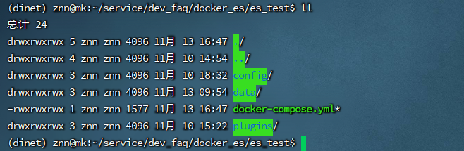
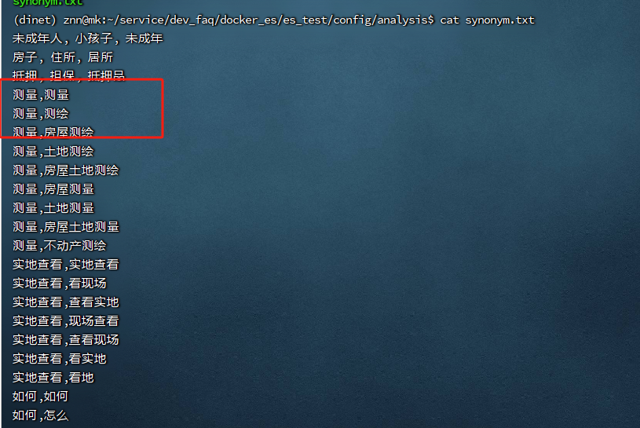
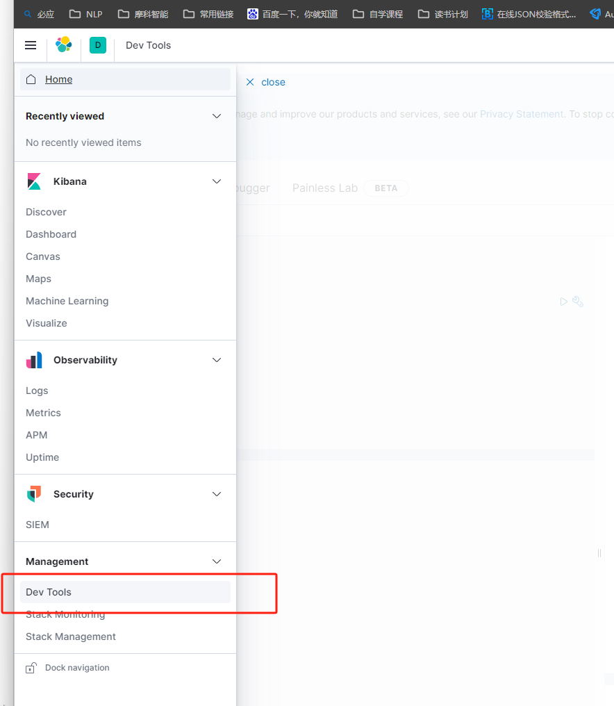
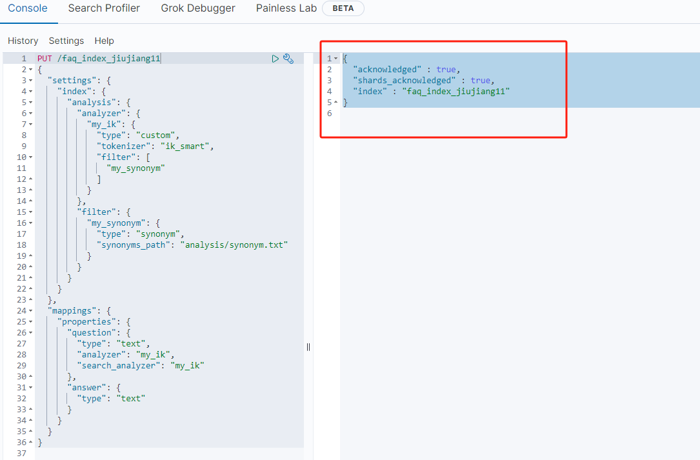

# elasticsearch-7.8配置同义词操作

​		es数据库可以配置同义词，我在研究的过程中发现网络上的这一部分知识很零散，而且好多知识都是错误的，根本没有办法复现，下面我根据自己的实践操作整理一下这方面的资料

## 一、操作步骤

​		1.1、构建es和kibana

​		这里统一采用的是7.8版本的，在安装操作前需要保证docker和docker-compose环境正常即可。



docker-compose.yml中的内容如下：

```
version: '3'
networks:
  es:

services:
  elasticsearch:
    image: elasticsearch:7.8.0 
    restart: unless-stopped 
    volumes:
      - es_test/data:/usr/share/elasticsearch/data
      - config/elasticsearch.yml:/usr/share/elasticsearch/config/elasticsearch.yml
      - config/analysis/synonym.txt:/usr/share/elasticsearch/config/analysis/synonym.txt
      - plugins:/usr/share/elasticsearch/plugins
    environment:                              
      TZ: Asia/Shanghai
      LANG: en_US.UTF-8
      discovery.type: single-node
      ES_JAVA_OPTS: "-Xmx512m -Xms512m"
      ELASTIC_PASSWORD: "chana123"
    ports:
      - "9200:9200"
      - "9300:9300"
    networks:
      - es

  kibana:
    image: kibana:7.8.0
    container_name: kibana
    restart: unless-stopped

```

注意事项：

（1）es配置config中elasticsearch.yml需要配置以下参数：

```
cluster.name: "docker-cluster"
network.host: 0.0.0.0
http.port: 9200
# 开启es跨域
http.cors.enabled: true
http.cors.allow-origin: "*"
http.cors.allow-headers: Authorization
# # 开启安全控制
xpack.security.enabled: true
xpack.security.transport.ssl.enabled: true
```

（2）analysis目录需要加载synonym.txt同义词词典，它的格式如下：



两个同义词为一行，中间必须用英文逗号分隔，前三行是我测试数据，如果需要准备同义词，请按照红框内框内数据准备即可。

（3）docker-compose配置完毕后，记得第一时间给es数据库安装ik插件，它是用来给es指定字段进行分词的工具，具体版本可以根据es版本进行调整。IK分词器下载地址：https://github.com/medcl/elasticsearch-analysis-ik/releases，安装过程可以参考[es安装ik分词器](https://blog.csdn.net/qq233325332/article/details/125690945?spm=1001.2101.3001.6661.1&utm_medium=distribute.pc_relevant_t0.none-task-blog-2%7Edefault%7EBlogCommendFromBaidu%7ERate-1-125690945-blog-99704239.235%5Ev38%5Epc_relevant_anti_t3&depth_1-utm_source=distribute.pc_relevant_t0.none-task-blog-2%7Edefault%7EBlogCommendFromBaidu%7ERate-1-125690945-blog-99704239.235%5Ev38%5Epc_relevant_anti_t3&utm_relevant_index=1)


1.2、启动kibana

​	(1)如果服务部署在宿主机上，可以通过ip+端口访问到

（2）输入对应的账号和密码，这个账号和密码就是

（3）点击页面红框‘Dev Tools’




1.3、建立索引

此时再灌入数据前，需要根据数据格式，提前设置关键词检索和近义词检索的配置索引。这也是同义词检索是否能够生效的关键。同时保证es数据库没有该索引，如果有需要删除后，使用下面命令建立索引。

```
PUT /faq_index_jiujiang # faq_index_jiujiang为es需要灌入数据的索引
{
  "settings": {
    "index": {
      "analysis": {
        "analyzer": {
          "my_ik": {
            "type": "custom",
            "tokenizer": "ik_smart",
            "filter": [
              "my_synonym"
            ]
          }
        },
        "filter": {
          "my_synonym": {
            "type": "synonym",
            "synonyms_path": "analysis/synonym.txt" # 配置docker所在目录地址
          }
        }
      }
    }
  },
  "mappings": {
    "properties": {
      "question": {# 这里只是对question字段进行同义词检索，因此answer就没有设置
        "type": "text",
        "analyzer": "my_ik",
        "search_analyzer": "my_ik"
      },
      "answer": {
        "type": "text"
      }
    }
  }
}
```

下面以另一个索引为例，进行操作原理都是都是一样的。



1.4、批量灌入数据集

数据格式如下，我们主要用于建立qa数据集，只需要关注question即可，后续主要关注qq问答，并不涉及qa问答

```
    {
        "知识id": 30010820231,
        "类目id": 30000104008,
        "类目路径（多级类目用/分隔）": "九江/业务操作类/房地登记/国有建设用地使用权及房屋所有权/转移登记/存量房",
        "知识标签（最多30个字）": "",
        "知识标题": "存量房买卖在哪里办理？",
        "相似问法": "存量房过户在哪办理\n二手房过户在哪办理\n二手房买卖，可来窗口查询不动产权属吗？\n能办理二手房买卖业务的网点都有哪些？\n哪些行政服务中心能办理二手房业务？\n二手房买卖业务可以去哪些地方办理？\n什么地方可以办理存量房买卖？\n哪里可以受理存量房买卖？\n周末可以办理存量房买卖业务吗？\n不动产买卖过户全城通办吗？\n哪儿能办存量房买卖？\n房屋买卖业务全城通办吗？\n存量房买卖的办理地址在哪？",
        "关联问题": [
            "存量房买卖需要哪些申请资料？",
            "存量房买卖办理需要多久？",
            "存量房买卖办理是否收费？",
            "存量房买卖可以不需要中介吗？",
            "二手房交易，买卖双方是否均需预约？"
        ],
        "创建时间": "2022-12-13 11:18:51",
        "修改时间": "2023-04-14 13:20:33",
        "创建人": "杭州摩科商用设备有限公司",
        "修改人": "杭州摩科商用设备有限公司",
        "答案（默认)【富文本】": "存量房买卖在哪里办理？1、八里湖新区体育路66号市政务服务中心二楼综合受理二区不动产专区;2、浔阳区长虹大道32号税务办税大厅二楼不动产专区;3、濂溪区十里大道1494号濂溪区政务服务中心一楼不动产专区;4、经开区九瑞大道155号经开区行政服务中心一楼不动产专区；以上网点办公时间:9:00-12:00，13:30-17:00;中午和周末有错时延时服务。5、经开区大润发蓝钻中心13楼房大全科技有限公司便民服务点；6、经开区联盛快乐城2号楼7楼九江贝壳找房科技有限公司便民服务点。",
        "答案（默认)【纯文本】": "",
        "question": "存量房过户在哪办理",
        "answer": "存量房买卖在哪里办理？1、八里湖新区体育路66号市政务服务中心二楼综合受理二区不动产专区;2、浔阳区长虹大道32号税务办税大厅二楼不动产专区;3、濂溪区十里大道1494号濂溪区政务服务中心一楼不动产专区;4、经开区九瑞大道155号经开区行政服务中心一楼不动产专区；以上网点办公时间:9:00-12:00，13:30-17:00;中午和周末有错时延时服务。5、经开区大润发蓝钻中心13楼房大全科技有限公司便民服务点；6、经开区联盛快乐城2号楼7楼九江贝壳找房科技有限公司便民服务点。"
    },
    {
        "知识id": 30010820231,
        "类目id": 30000104008,
        "类目路径（多级类目用/分隔）": "九江/业务操作类/房地登记/国有建设用地使用权及房屋所有权/转移登记/存量房",
        "知识标签（最多30个字）": "",
        "知识标题": "存量房买卖在哪里办理？",
        "相似问法": "存量房过户在哪办理\n二手房过户在哪办理\n二手房买卖，可来窗口查询不动产权属吗？\n能办理二手房买卖业务的网点都有哪些？\n哪些行政服务中心能办理二手房业务？\n二手房买卖业务可以去哪些地方办理？\n什么地方可以办理存量房买卖？\n哪里可以受理存量房买卖？\n周末可以办理存量房买卖业务吗？\n不动产买卖过户全城通办吗？\n哪儿能办存量房买卖？\n房屋买卖业务全城通办吗？\n存量房买卖的办理地址在哪？",
        "关联问题": [
            "存量房买卖需要哪些申请资料？",
            "存量房买卖办理需要多久？",
            "存量房买卖办理是否收费？",
            "存量房买卖可以不需要中介吗？",
            "二手房交易，买卖双方是否均需预约？"
        ],
        "创建时间": "2022-12-13 11:18:51",
        "修改时间": "2023-04-14 13:20:33",
        "创建人": "杭州摩科商用设备有限公司",
        "修改人": "杭州摩科商用设备有限公司",
        "答案（默认)【富文本】": "存量房买卖在哪里办理？1、八里湖新区体育路66号市政务服务中心二楼综合受理二区不动产专区;2、浔阳区长虹大道32号税务办税大厅二楼不动产专区;3、濂溪区十里大道1494号濂溪区政务服务中心一楼不动产专区;4、经开区九瑞大道155号经开区行政服务中心一楼不动产专区；以上网点办公时间:9:00-12:00，13:30-17:00;中午和周末有错时延时服务。5、经开区大润发蓝钻中心13楼房大全科技有限公司便民服务点；6、经开区联盛快乐城2号楼7楼九江贝壳找房科技有限公司便民服务点。",
        "答案（默认)【纯文本】": "",
        "question": "二手房过户在哪办理",
        "answer": "存量房买卖在哪里办理？1、八里湖新区体育路66号市政务服务中心二楼综合受理二区不动产专区;2、浔阳区长虹大道32号税务办税大厅二楼不动产专区;3、濂溪区十里大道1494号濂溪区政务服务中心一楼不动产专区;4、经开区九瑞大道155号经开区行政服务中心一楼不动产专区；以上网点办公时间:9:00-12:00，13:30-17:00;中午和周末有错时延时服务。5、经开区大润发蓝钻中心13楼房大全科技有限公司便民服务点；6、经开区联盛快乐城2号楼7楼九江贝壳找房科技有限公司便民服务点。"
    },
```

下面数据插入es的部分代码，这些代码可以批量插入上面的字段数据集。

```
    def insert_data(self, data_list):
        # 建立索引然后写入对应的库
        if self.es.indices.exists(index=self.index):
            self.es.indices.delete(index=self.index)

        self.es.indices.create(index=self.index,
                               body={
                                   "mappings": {
                                       "properties": {
                                           "question": {
                                               "type": "text",
                                               "fields": {
                                                   "raw": {
                                                       "type": "keyword"
                                                   }
                                               }
                                           },
                                           "answer": {
                                               "type": "text",
                                               "fields": {
                                                   "raw": {
                                                       "type": "keyword"
                                                   }
                                               }
                                           }
                                       }
                                   }
                               })

        # 将数据插入到Elasticsearch
        def generate_bulk_data(index_name, list_of_dicts):
            for doc in tqdm(list_of_dicts):
                try:
                    yield {
                        "_op_type": "index",
                        "_index": index_name,
                        "_source": doc
                    }
                except:
                    print("****"*100)
                    print({
                        "_op_type": "index",
                        "_index": index_name,
                        "_source": doc
                    })

        helpers.bulk(self.es, generate_bulk_data(self.index, data_list))

```


1.5、同义词查询字段

​	下面有两个方式效果都是样的

（1）方法1

```
GET /faq_index_jiujiang/_search
{
  "query" : { "match" : { "content" : "es" }},
  "highlight" : {
    "pre_tags" : ["<tag1>", "<tag2>"],
    "post_tags" : ["</tag1>", "</tag2>"],
    "fields" : {"content": {}}
  }
}
```

（2）方法2

```
GET /faq_index_jiujiang/_search
{
  "query": {
    "match": {
      "question": "查册"
    }
  }
}
```

## 2、参考资料

（1）https://blog.csdn.net/A15130402745/article/details/130062949

（2）https://cloud.tencent.com/document/product/845/45261

## 3、备注

​		。。。。更新中
