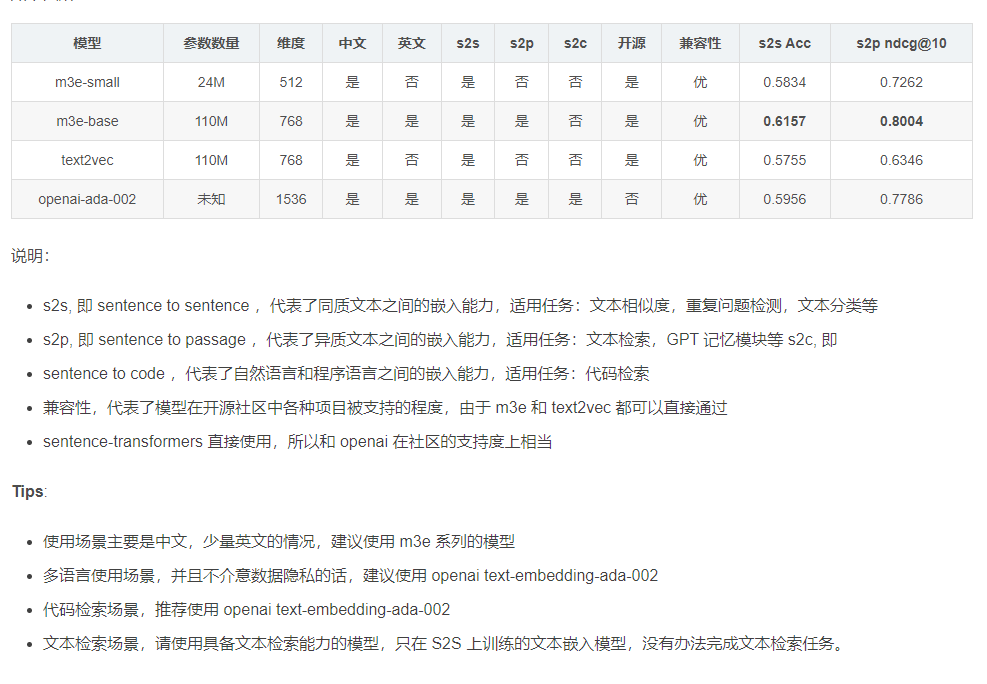

#  [Text embedding模型总结](https://blog.csdn.net/dzysunshine/article/details/133674250)

​		目前，随着 Langchain + LLM模型 的火热，除了层出不穷的大模型外，因为检索的能力会很大程度影响最终的问答效果，文本的向量表示模型也是大家比较关注的。本文主要介绍几种效果较好的文本向量表示模型。

# 一、MTEB榜单

​		判断哪些文本嵌入模型效果较好，通常需要一个评估指标来进行比较，MTEB就是一个海量文本嵌入模型的评估基准。
​		MTEB: Massive Text Embedding Benchmark（海量文本嵌入基准）

​		论文地址：https://arxiv.org/abs/2210.07316
​		github地址：https://github.com/embeddings-benchmark/mteb#leaderboard
​		论文摘要如下：
​		文本嵌入通常在单个任务的一小部分数据集上进行评估，而不包括它们在其他任务中的可能应用。目前尚不清楚最新的语义文本相似性嵌入(STS)是否可以同样很好地应用于其他任务，如聚类或重新排序。这使得该领域的进展难以跟踪，因为各种模型不断被提出而没有得到适当的评估。为了解决这个问题，我们引入了海量文本语义向量基准测试(MTEB)。MTEB包含8个语义向量任务，涵盖58个数据集和112种语言。通过在MTEB上对33个模型进行基准测试，我们建立了迄今为止最全面的文本嵌入基准。我们发现没有特定的文本嵌入方法在所有任务中都占主导地位。这表明该领域尚未集中在一个通用的文本嵌入方法上，并将其扩展到足以在所有嵌入任务上提供最先进的结果。

​	榜单地址：https://huggingface.co/spaces/mteb/leaderboard

# 二、8个嵌入任务

**2.1、Bitext Mining（双语文本挖掘）**

​		输入是来自两种不同语言的两组句子。对于第一组中的每个句子，需要在第二组中找到最佳匹配。匹配通常是翻译。所提供的模型用于嵌入每个句子，并通过余弦相似度找到最接近的对。
**2.2、Classification（分类）**

​		训练和测试集均使用所提供的模型进行文本嵌入表示。训练集用于训练逻辑回归分类器（如最大迭代100次），在测试集中进行评分。
**2.3、Clustering（聚类）**

​		给定一组句子或段落，目标是将它们分组成有意义的类。
**2.4、Pair Classification（句子对分类）**

​		提供一对文本输入，并需要分配一个标签。标签通常是表示重复或释义对的二进制变量。两个文本通过模型嵌入，它们的距离用各种度量来计算(余弦相似度，点积，欧氏距离，曼哈顿距离)。
**2.5、Reranking（重新排序）**

​		输入是一个查询query和文本的列表（列表中是与query相关或不相关的文本）。其目的是根据与查询的相关性对结果进行排序。文本和query通过模型进行嵌入，然后使用余弦相似度将其与查询进行比较。对每个查询进行评分，并在所有查询中取平均值。指标是平均MRR@k和MAP，后者是主要指标。
**2.6、Retrieval （检索）**

​		每个数据集由语料库、查询query和每个查询到语料库中相关文档的映射组成。目的是找到这些相关文件。所提供的模型用于嵌入所有查询和所有语料库文档，并使用余弦相似度计算相似度分数。根据分数对每个查询的语料库文档进行排序后，分别计算nDCG@k, MRR@k，MAP@k、precision@k和recall@k。nDCG@10作为主要度量。
**2.7、Semantic Textual Similarity(STS)（语义文本相似度）**

​		给定一对句子，目的是确定它们的相似度。标签是连续得分，数字越高表示句子越相似。所提供的模型用于嵌入句子，并使用各种距离度量来计算句子的相似度。距离的基准是使用Pearson和Spearman相关性的真实相似度。基于余弦相似度的Spearman相关作为主要度量。
**2.8、Summarization（摘要）**

​		提供了一组人工编写和机器生成的摘要。目的是给机器生成的摘要进行打分。所提供的模型首先用于嵌入所有摘要。对每个机器生成的摘要嵌入，计算与所有人类摘要嵌入的距离。最接近的分数(例如，最高余弦相似度)被保留并用作单个机器生成摘要的模型分数。

# 三、三种数据集类别

**3.1、句子对句子(S2S)**

​		一个句子与另一个句子比较。S2S的一个例子是MTEB中所有当前的STS任务，其中评估两个句子之间的相似性。适用任务：文本相似度匹配，重复问题检测，文本分类等；
**3.2、段落到段落(P2P)**

​		将一个段落与另一个段落进行比较。MTEB对输入长度没有限制，在必要时由模型截断。一些聚类任务为S2S和P2P任务。前者只比较标题，后者包括标题和内容。例如，对于ArxivClustering，在P2P设置下，摘要被连接到标题。适用任务：聚类。
**3.3、句子到段落(S2P)**

​		在S2P设置中混合了几个检索数据集。这里的查询是一个句子，而文档是由多个句子组成的长段落。适用任务：文本检索。

# 四、C_MTEB榜单

​		C_MTEB榜单地址：https://github.com/FlagOpen/FlagEmbedding/tree/master/C_MTEB#leaderboard
最全面的中文语义向量评测基准C-MTEB 开源，涵盖6大类评测任务（检索、排序、句子相似度、推理、分类、聚类），涉及31个相关数据集，已合并至 Hugging Face MTEB leaderboard 中。

# 五、文本向量表示模型

**5.1、text2vec 模型**
项目地址：https://github.com/shibing624/text2vec
中文匹配模型shibing624/text2vec-base-chinese是基于中文STS训练集训练的CoSENT匹配模型。CoSENT模型提出了一种排序的损失函数，使训练过程更贴近预测，模型收敛速度和效果比Sentence-BERT更好。

**5.2、m3e模型**
		M3E Models ：Moka（北京希瑞亚斯科技）开源的系列文本嵌入模型。
		m3e-base项目地址：https://huggingface.co/moka-ai/m3e-base
		m3e-small项目地址:https://huggingface.co/moka-ai/m3e-small

```
M3E 是 Moka Massive Mixed Embedding 的缩写

Moka，此模型由 MokaAI 训练，开源和评测，训练脚本使用 uniem ，评测 BenchMark 使用 MTEB-zh。
Massive，此模型通过千万级 (2200w+) 的中文句对数据集进行训练。
Mixed，此模型支持中英双语的同质文本相似度计算，异质文本检索等功能，未来还会支持代码检索。
Embedding，此模型是文本嵌入模型，可以将自然语言转换成稠密的向量。
```


**5.3、bge模型**
		项目地址：https://github.com/FlagOpen/FlagEmbedding
		博客链接：https://zhuanlan.zhihu.com/p/648448793
		BGE 模型链接：https://huggingface.co/BAAI/
		BGE是北京智源人工智能研究院发布的中英文语义向量模型。在中英文语义检索精度与整体语义表征能力均超越了社区所有同类模型（后来又被其他模型超越)，如OpenAI 的text embedding 002等。此外，BGE 保持了同等参数量级模型中的最小向量维度，使用成本更低。

```
BGE的技术亮点：
高效预训练和大规模文本微调；
在两个大规模语料集上采用了RetroMAE预训练算法，进一步增强了模型的语义表征能力；
通过负采样和难负样例挖掘，增强了语义向量的判别力；
借鉴Instruction Tuning的策略，增强了在多任务场景下的通用能力。
```

**5.4、RetroMAE预训练**
		主要思想是encoder用小一点的mask rate得到sentence embedding，然后decoder用大一点的mask rate结合encoder得到的sentence embedding进行重构。
		此外，为了使得每个token使用的context信息不同，RetroMAE还使用了增强解码的方法。

**5.5、piccolo模型**
		项目地址：https://huggingface.co/sensenova
		piccolo是一个通用embedding模型(中文), 由来自商汤科技的通用模型组完成训练。piccolo借鉴了**E5（微软）以及GTE（阿里达摩院）的训练流程，采用了两阶段的训练方式。
		在第一阶段中，我们搜集和爬取了4亿的中文文本对**(可视为弱监督文本对数据)，并采用二元组的softmax对比学习损失来优化模型。
		在第二阶段中，我们搜集整理了2000万人工标注的中文文本对(精标数据)，并采用带有难负样本的三元组的softmax对比学习损失来帮助模型更好地优化。 目前，我们提供了piccolo-base-zh和piccolo-large-zh两个模型。

（1）pretrain细节
			pretrain 通常不需要太大的max length, 推荐128。小的max length用以提高batch size，加快训练速度，从而适应大规模数据。 pretrain 损失我们采用二元组contrastive loss，不加入hard negative, 直接采用inbatch negative，在实际训练中，我们使用了32张40G A100进行训练，单卡的batch size为1024。

（2）finetune细节
			finetune 通常会将 max length扩增到512。用以适应更大长度的文本输入，finetune时会多sample S2P的数据，以增强模型在retrieval任务上的性能。 finetune 损失采用三元组contrastive loss，加入hard negative，neg num通常设置为2-7，loss计算方式可以参考GTE（阿里达摩院）里的improved contrastive loss。 注意: 我们给query和passage设置了不同的max length，query的max length始终保持在64。

**5.6、stella模型**
		项目地址：https://huggingface.co/infgrad/stella-base-zh
		博客地址：https://zhuanlan.zhihu.com/p/655322183
		stella是一个通用的中文文本编码模型，目前有两个版本：base 和 large，2个版本的模型均支持1024的输入长度。

（1）训练数据
		开源数据(wudao_base_200GB[1]、m3e[2]和simclue[3])，着重挑选了长度大于512的文本
在通用语料库上使用LLM构造一批(question, paragraph)和(sentence, paragraph)数据

（2）训练方法
		对比学习损失函数 带有难负例的对比学习损失函数(分别基于bm25和vector构造了难负例) EWC(Elastic Weights
Consolidation) cosent loss 每一种类型的数据一个迭代器，分别计算loss进行更新
（3）初始权重
		stella-base-zh和stella-large-zh分别以piccolo-base-zh[6]和piccolo-large-zh作为基础模型，512-1024的position embedding使用 层次分解位置编码（苏神）进行初始化。piccolo是商汤科技研究院开源的piccolo系列模型。


版权声明：本文为CSDN博主「dzysunshine」的原创文章，遵循CC 4.0 BY-SA版权协议，转载请附上原文出处链接及本声明。
原文链接：https://blog.csdn.net/dzysunshine/article/details/133674250

