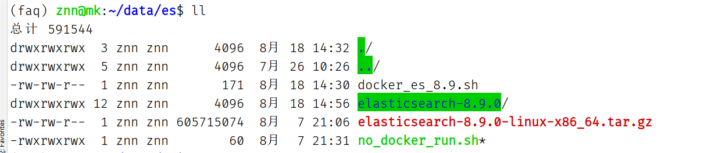
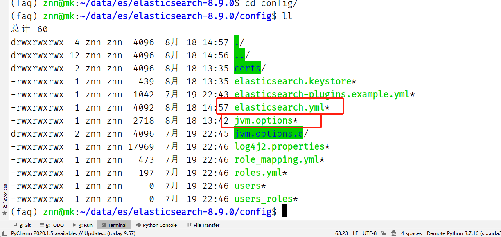
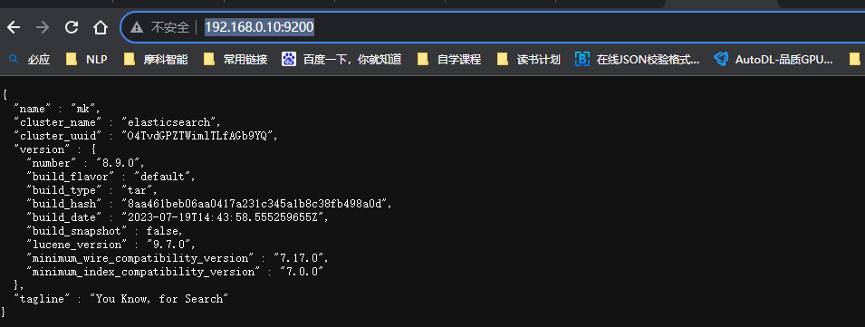

# elasticsearch-8.9采坑

## 一、操作步骤

​		我采用的是非docker版本，直接使用elasticsearch-8.9.0-linux-x86_64.tar.gz 解压进行直接启动操作。

​		步骤1：从[csdn网站](https://download.csdn.net/download/h735004790/88152865)可以下载elasticsearch-8.9.0-linux-x86_64.tar.gz；

​		步骤2：解压.tar.gz文件，获得

```
tar -xzvf elasticsearch-8.9.0-linux-x86_64.tar.gz
```



​		步骤3：修改配置文件，需要修改的文件包括两个elasticsearch.yml和jvm.options.d



​		(1)修改elasticsearch.yml 

```shell

xpack.security.enabled: false
xpack.security.enrollment.enabled: false
xpack.security.http.ssl:
  enabled: false
  keystore.path: certs/http.p12
xpack.security.transport.ssl:
  enabled: true
  verification_mode: certificate
  keystore.path: certs/transport.p12
  truststore.path: certs/transport.p12
cluster.initial_master_nodes: ["mk"]
http.host: 0.0.0.0

```

​		(2)修改jvm.options

```
-Xms1g
-Xmx1g
```

​		步骤4：安装ik分词器这里直接使用elasticsearch-analysis-ik-8.9.0.zip，将它解压至elasticsearch-8.9.0/plugins/ik，注意检查文件不要有遗漏。[分词器安装](https://blog.csdn.net/qq_39939541/article/details/131619209)

​		步骤5：启动服务，直接执行no_docker_run.sh，对应脚本的命令如下：

```
./elasticsearch-8.9.0/bin/elasticsearch -d
```

​		步骤6：验证服务是否真正启动，可以使用curl命令或者使用网页打开，注意端口和ip不要写错。



## 二、常见问题

（1）elasticsearch.BadRequestError: BadRequestError(400, 'illegal_argument_exception', 'Custom Analyzer [ik_analyzer] failed to find tokenizer under name [ik_max_word]')这个错误提示的是在使用 Elasticsearch 的时候，尝试使用一个自定义分析器 `ik_analyzer`，但是在配置中没有找到名为 `ik_max_word` 的分词器。`ik_max_word` 是 IK 分词器的一个模式。IK 分词器是一个中文分词器，通常用于 Elasticsearch 中处理中文文本。很大可能没有安装指定的ik分词器。

（2）Native controller process has stopped - no new native processes can be start，本问题的[解决方法](https://www.jianshu.com/p/376042ce0faf)


## 三、elasticsearch 常见用法

### 3.1、[使用向量字段进行文本相似度搜索](https://www.elastic.co/cn/blog/text-similarity-search-with-vectors-in-elasticsearch)

### 3.2、[Elasticsearch: 基于Text Embedding的文本相似性搜索](https://zhuanlan.zhihu.com/p/80737146)

### 3.3、[Elasticsearch：如何部署 NLP：文本嵌入和向量搜索](https://blog.csdn.net/UbuntuTouch/article/details/124920166)

```python
es_search_params = {
    "port": 9200,
    "host": '192.168.0.10',
    "index": "faq_index",
    "model_path": '/home/znn/service/faq/test/bge-large-zh'
}

class ES_Processor:
    def __init__(self):
        self.index = es_search_params['index']
        self.model_path = es_search_params['model_path']
        self.es = self._es_run()

    def _es_run(self):
        _es_run = Elasticsearch([{'host': es_search_params['host'], 'port': es_search_params['port']}])
        return _es_run

    def get_embedding_vector(self, _sentence_list):
        model = FlagModel(self.model_path,
                          query_instruction_for_retrieval="为这些句子生成表示以用于检索相关文章：")
        _sentence_list = _sentence_list if not isinstance(es_processor, str) else [_sentence_list]
        embeddings = model.encode(_sentence_list)
        return embeddings

    def insert_vector(self, embeddings, sentence_list):
        # 确保索引不存在
        if self.es.indices.exists(index=self.index):
            self.es.indices.delete(index=self.index)

        # 创建一个新的索引
        self.es.indices.create(index=self.index, body={
            "settings": {
                "analysis": {
                    "analyzer": {
                        "ik_analyzer": {
                            "type": "custom",
                            "tokenizer": "ik_max_word"
                        }
                    }
                }
            },
            "mappings": {
                "properties": {
                    "question": {
                        "type": "text",
                        "analyzer": "ik_analyzer"
                    },
                    "vector": {
                        "type": "dense_vector",
                        "dims": embeddings.shape[1]  # 假设您使用的向量长度为768
                    }
                }
            }
        })

        # 存储到Elasticsearch
        for _num, sentence in enumerate(tqdm(sentence_list)):
            try:
                sentence_emb1 = embeddings[_num]
                self.es.index(index=self.index, body={"question": sentence, "vector": sentence_emb1})
            except Exception as e:
                print(f"数据存储异常:{e}，问题文本为：{sentence}")
            else:
                print("数据文本和词向量写入es成功！！")

    def text_and_vector_search_query(self, question, query_vector, min_score):
        query_body = {
            "query": {
                "bool": {
                    "should": [
                        {"match": {"text": question}},
                        {
                            "script_score": {
                                "query": {"match_all": {}},
                                "script": {
                                    "source": "cosineSimilarity(params.query_vector, 'vector') + 1.0",
                                    "params": {
                                        "query_vector": query_vector
                                    }
                                }
                            }
                        }
                    ]
                }
            },
            "min_score": min_score
        }
        return query_body

    def check_vector(self, question, query_vector, _min_score, k_top=10):
        _query_check_body = self.text_and_vector_search_query(question, query_vector, _min_score)
        response = self.es.search(index=self.index, body=_query_check_body, size=k_top)
        for hit in response['hits']['hits']:
            print({"match_score": hit['_score'], "question": hit['_source']['question']})

    def check_text(self, question, min_score, k_top=10):
        # 定义查询
        text_query = {
            "query": {
                "match": {
                    "question": question
                }
            },
            "min_score": min_score
        }

        # 执行查询
        response = self.es.search(index=self.index, body=text_query, size=k_top)  # 替换your_index_name为你的索引名
        # index - 索引名
        # q - 查询指定匹配 使用Lucene查询语法
        # from_ - 查询起始点  默认0
        # doc_type - 文档类型
        # size - 指定查询条数 默认10
        # field - 指定字段 逗号分隔
        # sort - 排序  字段：asc/desc
        # body - 使用Query DSL
        # scroll - 滚动查询
        # 输出查询结果
        for hit in response['hits']['hits']:
            print({"match_score": hit['_score'], "question": hit['_source']['question']})
```

