#                                              **数字人方案调研**

# 1、概念

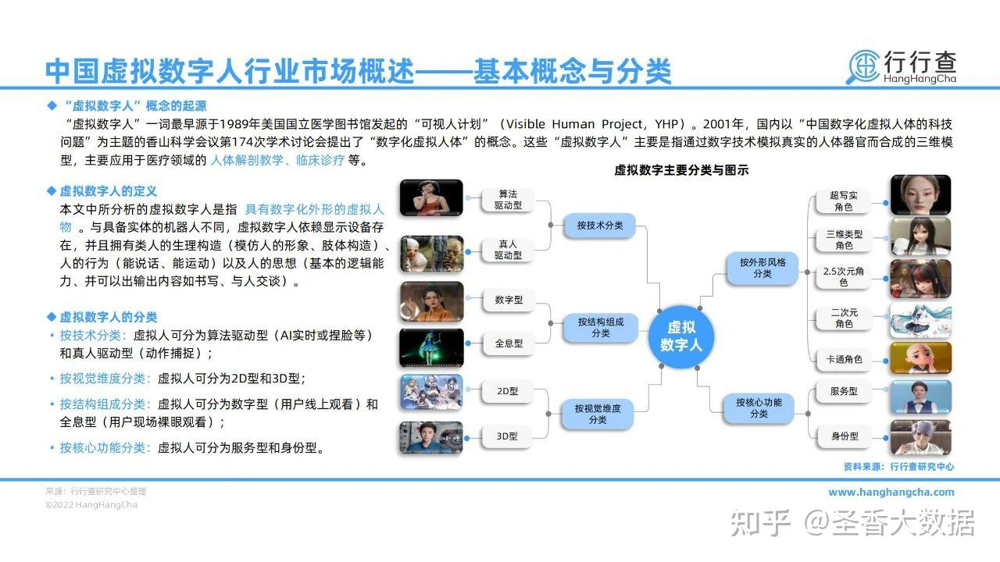

## 1.1、虚拟人

​		虚拟人是一种通过计算机图形学和虚拟现实技术创建的人体模拟实体，通常指在虚拟世界中的人物形象。虚拟人的外貌、动作和行为可以像真人一样逼真，但它们通常缺乏智能和自主性。他们具有以下三个特征：

​	（1）人物的身份是虚构的，现实世界中不存在的。
​	（2）虚拟人没有现实世界中的身体，它是通过计算机图形学技术和虚拟现实技术进行制作的，虚拟人的本体存在于各种计算设备中（例如电脑手机平板等），虚拟人需要通过显示设备来呈现，才能让人类的眼睛看见。
​	（3）虚拟人具有人类身体的外观形体结构和行为模式，表现出来的行为模式是与人类相仿的，可以呈现出某种指定角色的人类的活动。

## 1.2、数字人

​		数字人是一种通过计算机技术创建的人类形态的虚拟实体，指通过数字化技术生成的人物形象，包括人的外貌、语言、行为等，其目的是模拟人类的外貌、内部结构和行为模式。数字人具有一定程度的智能和自主性，可以根据不同情境做出反应和决策。数字人通常用于医疗、教育、娱乐影视特效、广告、教育等领域。

​		数字人称之为数字人，是强调了它存在于数字世界。而数字世界是人类设计运行于计算设备上的代码和数据，它是计算设备上运行的程序，数字世界是0和1这样的数据，相对于人类物理世界来说，物理世界是真实的，数字世界是虚拟的。数字人基本满足虚拟人的第二、三项特征，稍有区别的是，数字人的身份设定可以是按照现实世界中的人物进行设定，外观也可以完全一致，按照真人还原制作的数字人也可以称为数字孪生。

​		数字人还分为2d和3d数字人。2d数字人通常是指二维平面上的数字人物，是指二维的平面画像或者动画人物，通常只有二维的表现形式，无法在真实的三维空间中运动和交互。

​		3d数字人则是指三维的立体模型，是指以三维空间建模为基础的数字人物，通过计算机图形学建模软件创建，可以在真实的三维空间中自由运动和交互。3D数字人具有更真实的外观和更高的可交互性。相比较而言，3D数字人在表现形式和逼真程度上更加接近真实人物，且可以进行更加自由的姿态、动作和表情的表达。可以更真实地呈现物体的大小、形状和深度感，可以与环境中的其他物体进行交互，如碰撞、移动等。3D数字人还可以使用更高级的动画技术，如骨骼动画、肌肉动画等，使其运动更加流畅和逼真。3D数字人更加适用于虚拟现实、增强现实等应用领域。

## 1.3、虚拟数字人

​		虚拟数字人是指通过计算机技术和人工智能算法构建的数字化人物，也被称为数字人或虚拟角色。虚拟数字人是一种结合了虚拟人和数字人的特点的人工智能实体。是在虚拟世界中通过数字化技术生成的具有独特人格、语言、行为等特征的人物形象，它们可以拥有人类相似的逼真的外貌、语言、行为和情感，并能够像真实的人一样进行互动，还具有一定的智能和自主性。

　　虚拟数字人通常用于虚拟现实、人工智能、人机交互、游戏、智能机器人等领域，可以被用于电影、电视剧、游戏、虚拟现实等多种媒介中，以及人机交互、教育、医疗等。数字人的制作需要使用计算机生成技术，包括建模、动画、渲染、声音合成等。

​		虚拟数字人具备以下三个特征：

​	（1）拥有人的外观，具有特定的相貌、性别和性格等人物特征；

​	（2）拥有人的行为，具有用语言、面部表情和肢体动作表达的能力；

​	（3）拥有人的思想，具有识别外界环境、并能与人交流互动的能力。

虚拟人，数字人和虚拟数字人三者的关系详见下图

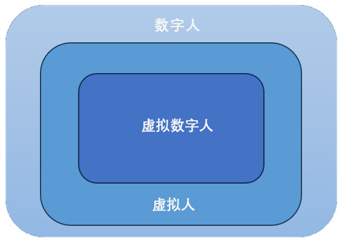


# 2、产业发展现状

## 2.1、数字人产品结构特征

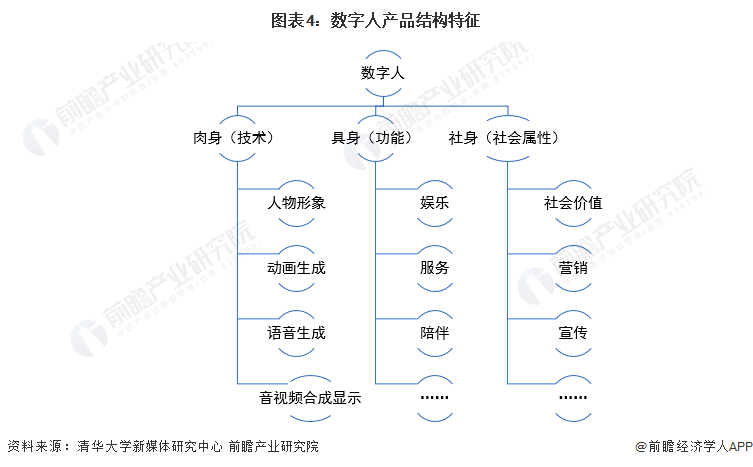

## 2.2、数字人产业链结构

​		虚拟数字人的产业链从上到下可以分为相关软硬件支撑、数字人产品生产运营和下游应用场景。上游硬件领域主要包括显示设备、芯片、交互相关期间和算力承载设备等;中游主要为数字人产品生产运营，下游应用领域主要包括ToB、ToC、ToG等应用场景。


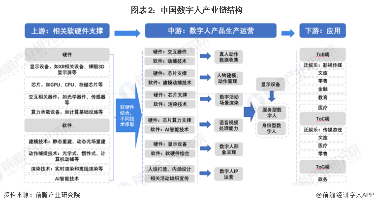

## 2.3、按商业和功能应用划分

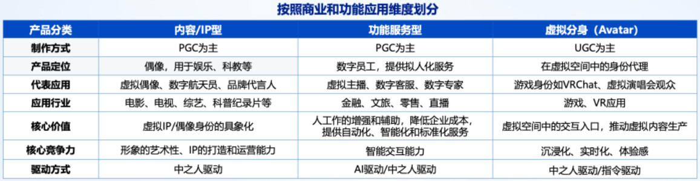

## 2.4、数字人应用场景

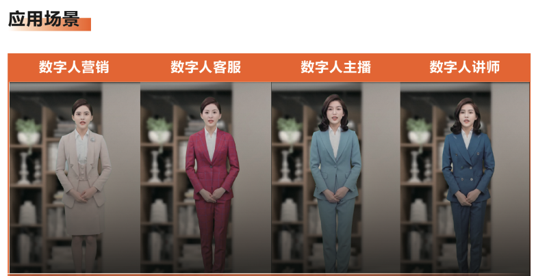

​		按面向人群分为三大类型：ToC端、ToB端、ToG端。中国数字人在行业应用中面向toC端、toB端和toG端均推出了不同类型的行业产品，包括但不限于传媒、游戏、文旅、医疗、零售、金融等行业领域，产品业态主要有虚拟主播、虚拟主持人、虚拟助手的等等。

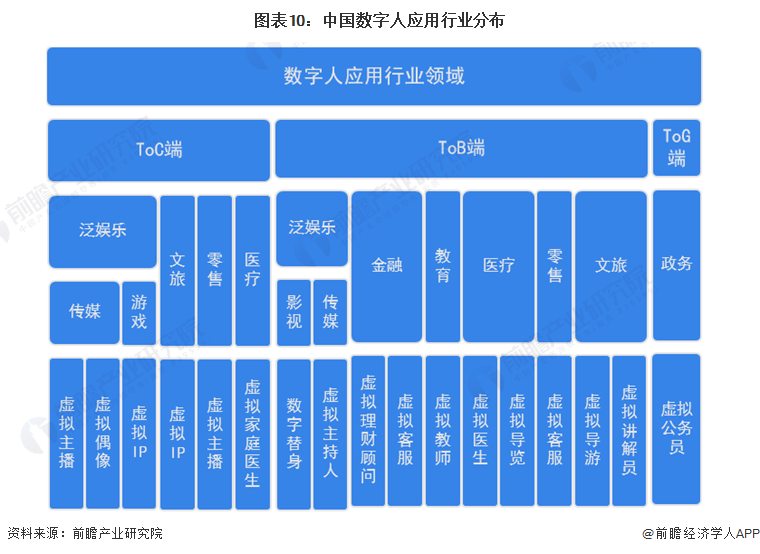

​		除了上述中规中矩的应用场景外，还有其他脑洞大开的应用场景，例如：可爱的数字精灵宠物，虚拟男女朋友，ai情感助手，数字人替身，超级智能数字人助手，数字人健身教练，数字人主播，虚拟讲解员，数字人美容师，数字人家庭医生等等。

## 2.5、数字人长夜发展十大趋势


​		从数字人的价值定位、核心技术、行业应用、C端发展、产业聚集 等十个不同维度进行剖析，挖掘出下面产业发展的十大趋势。

```
（1）数字人制造和运营服务的B端市场不断扩大，将面向更广大的C端用户提供服务，各类数字人价值定位和商业模式有差异。
（2）技术集综合迭代驱动数字人形似人，制作效能将继续提升。
（3）AI技术驱动数字人多模态交互更神似人，并逐步覆盖数字人全流程。
（4）数字人技术与SLAM、3D交互、体积视频、空间音频等技术深度融合，渲染将从本地到云端。
（5）千行千面的数字人将成为人机交互新入口，但深度上仍需挖掘。
（6）UGC数字人将加速出现，成为未来产业的增量空间。
（7）数字人仍以2D显示设备为主，3D显示设备成为特定领域的新解法。
（8）在场是数字人发展的高级阶段，将与应用场景深度耦合。
（9）艺术和技术双轮驱动，北京有望成为产业新高地。
（10）数字人版权保护及行业合规体系需同步建设，推动实现可用、可靠、可知、可控。
```

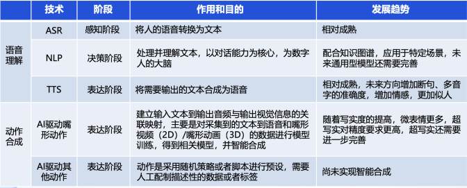

这两个图提及的就是趋势3的情况


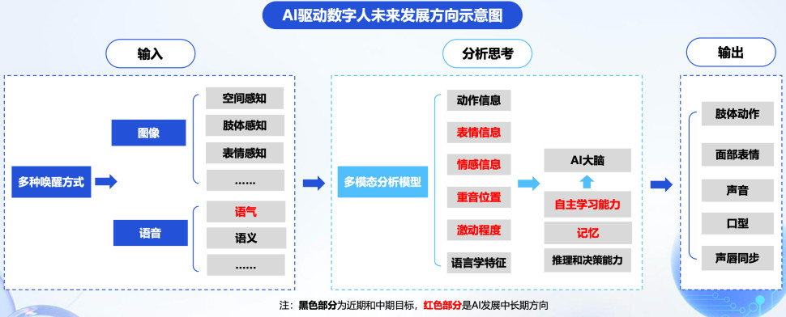


# 3、技术实现方法

## 3.1、技术实现过程

​		（1）数据收集。首先需要收集大量的数据，包括图像、语音、姿势、行为等各种类型的数据。这些数据可以来自各种来源，如公共数据集、社交媒体、游戏、虚拟现实等。

​		（2）数据预处理。对数据进行预处理，包括数据清洗、去噪、标注、对齐等。这些预处理步骤将有助于提高模型的精度和鲁棒性。

​		（3）模型训练。选择适当的神经网络结构，如生成对抗网络（GAN）、变分自编码器（VAE）等，并使用收集的数据进行模型训练。由于大模型所需的计算和存储资源较多，可以考虑使用分布式计算或云计算来加速训练和优化模型。

​		（4）模型优化。在训练模型的过程中，需要进行模型调优和超参优化，以提高模型的性能和准确性。这需要进行多次实验和测试，以找到最优的模型配置和超参数。

​		（5）虚拟人物生成。通过模型生成虚拟人物的图像、声音、行为等，可以使用混合现实技术、虚拟现实技术等来将生成的虚拟人物与现实世界进行交互和展示。

​		（6）模型迭代和更新。由于虚拟人物的需求和应用场景不断变化，在实际使用中，需要不断迭代和更新模型，以保持模型的准确性和实用性。

## 3.2、虚拟数字人涉及的AI技术

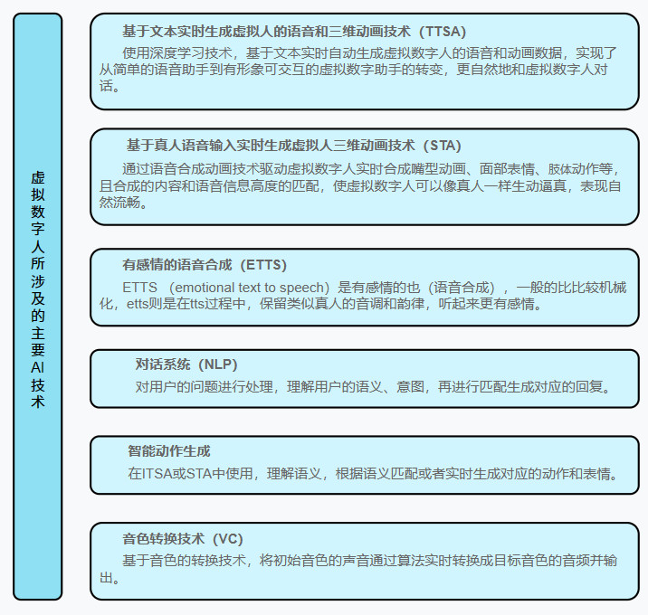

## 3.3、虚拟数字人制作流程

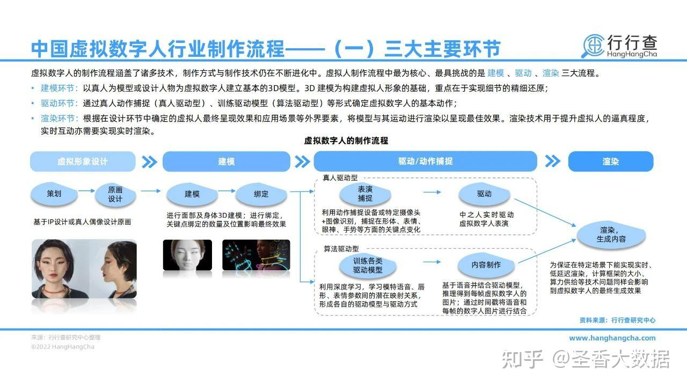

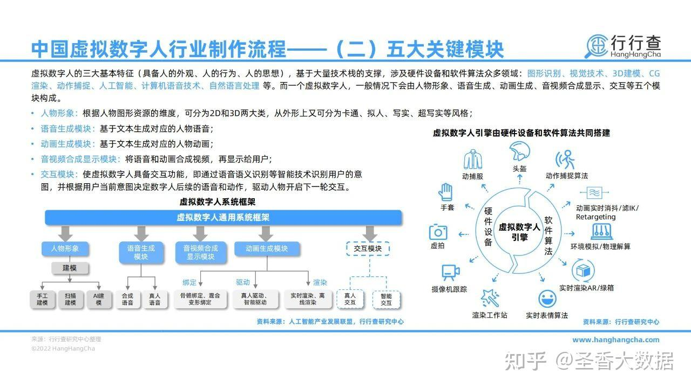

# 4、摩科数字人方案


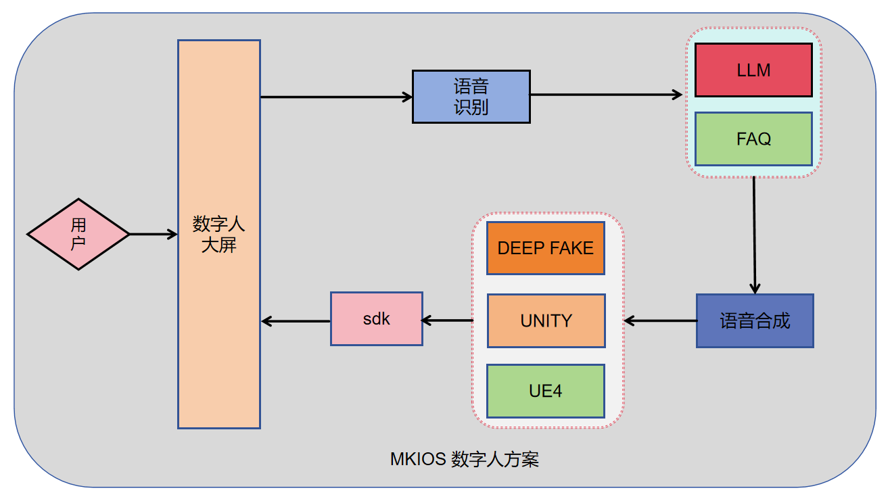

# 5、优秀专栏、项目和教程

## 5.1、专栏

（1）[知来者逆的博客](https://blog.csdn.net/matt45m/category_12465937.html)

（2）[Python AI数字人](https://blog.csdn.net/qq_20288327/category_10398892.html)


## 5.2、项目

（1）[ER-NeRF](https://github.com/Fictionarry/ER-NeRF ) 

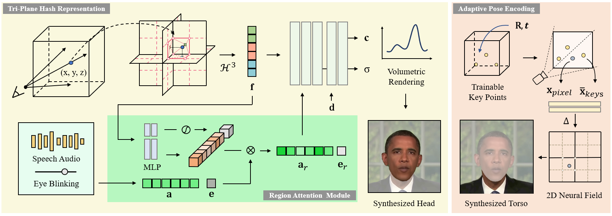

​		ER-NeRF是一种基于条件神经辐射场（NeRF）的会话肖像合成新架构，能够快速收敛、实时渲染且具有小模型大小。该方法通过利用不同区域对肖像建模的贡献不同，提出了一种紧凑且富有表达力的基于NeRF的三平面哈希表示方法来提高动态头部重建的准确性。实验结果表明，ER-NeRF方法能够渲染出更高保真度和音频-嘴唇同步的会话肖像视频，具有逼真的细节和高效率。

（2）[GeneFace](https://github.com/yerfor/GeneFace ) 

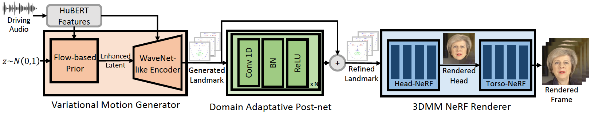

​		GeneFace对域外音频（如不同说话人、不同语种的音频）实现了更好的嘴唇同步和表现力。推荐您观看[此视频](https://geneface.github.io/GeneFace/example_show_improvement.mp4)，以了解GeneFace与之前基于NeRF的虚拟人合成方法的口型同步能力对比。

（3）[AD-NeRF](https://github.com/YudongGuo/AD-NeRF)

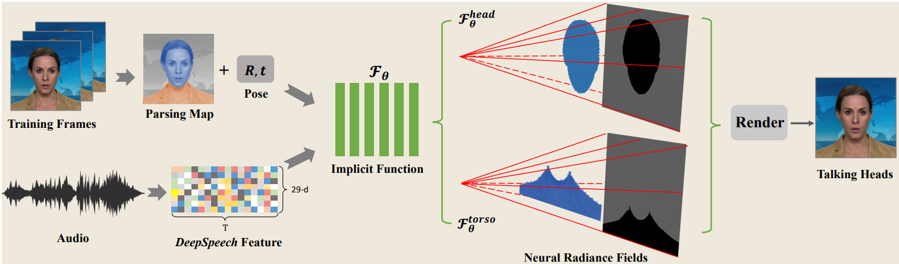

"Audio Driven Neural Radiance Fields for Talking Head Synthesis"是一个使用神经场景表示网络生成高保真说话人脸视频的算法。与依赖2D关键点或3D人脸模型的中间表征来缩小音频输入和视频输出之间的差距等方法不同，该算法直接将音频特征输入到约束隐式函数去生成一个动态神经辐射场，使用体渲染合成高保真说话人脸视频<a></a>。

（4）[Wav2Lip-CodeFormer](https://github.com/langzizhixin/Wav2Lip-CodeFormer)


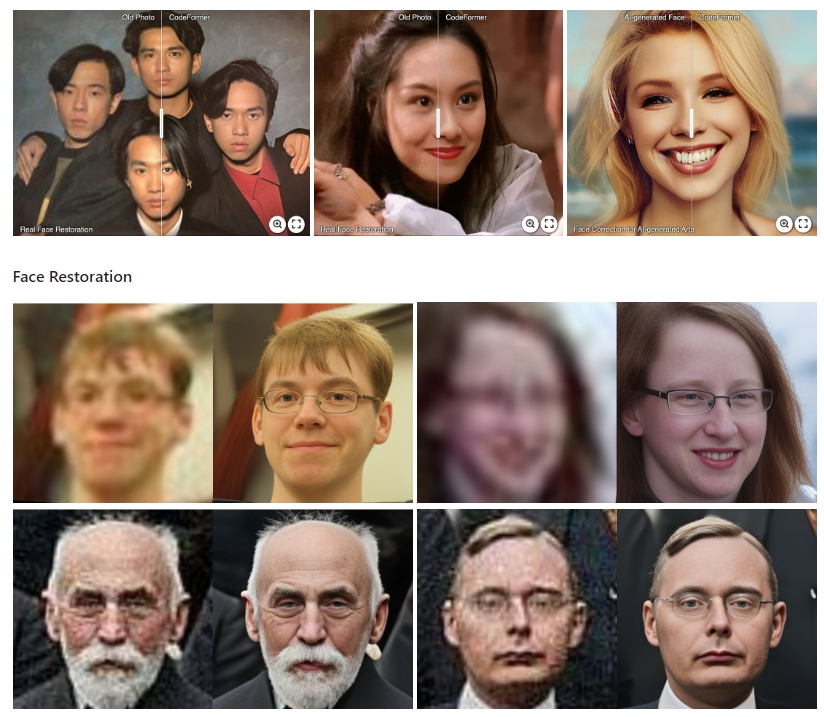

​		Wav2Lip-CodeFormer项目的重点在于使用Wav2Lip来修改嘴型，并使用CodeFormer进行高清处理。作者认为这个项目的表现优于Wav2Lip-GFPGAN，因为CodeFormer在面部恢复方面表现更好。

（5）[PaddleAvator](https://aistudio.baidu.com/projectdetail/6154230)

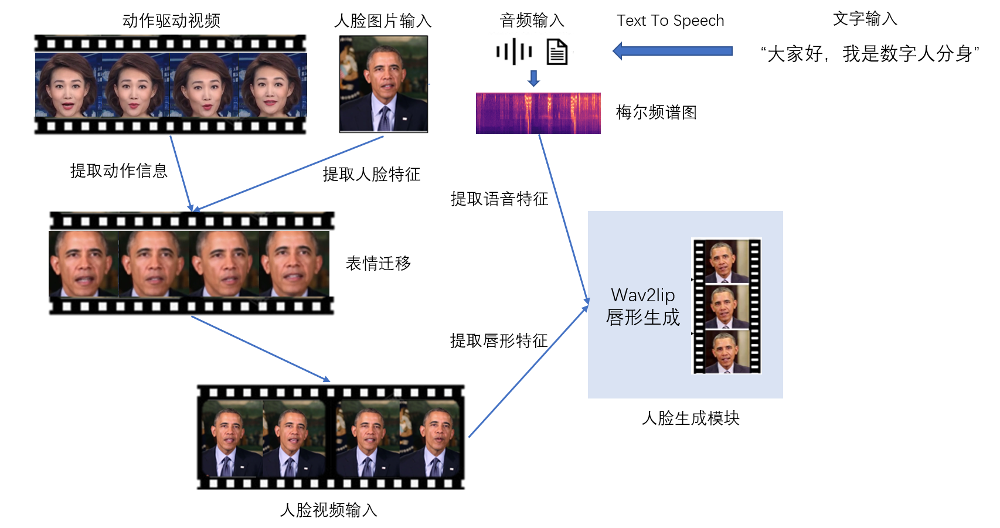

​		“数字人交互，与虚拟的自己互动”——用PaddleAvatar打造数字分身，探索人机交互的未来。`PaddleAvatar`是一种基于**PaddlePaddle**深度学习框架的数字人生成工具，基于Paddle的许多套件，它可以将您的数字图像、音频和视频合成为一个逼真的数字人视频。除此之外，`PaddleAvatar`还支持进一步的开发，例如使用自然语言处理技术，将数字人视频转化为一个完整的人机交互系统，使得您能够与虚拟的自己进行真实的对话和互动。

（6）[PaddleBoBo](https://aistudio.baidu.com/projectdetail/6304724?channelType=0&channel=0)

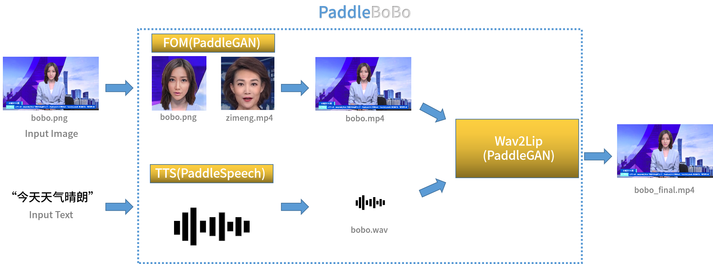

​		**[PaddleBoBo](https://github.com/JiehangXie/PaddleBoBo)**是基于飞桨PaddlePaddle深度学习框架和PaddleSpeech、PaddleGAN等开发套件的虚拟主播快速生成项目。PaddleBoBo致力于简单高效、可复用性强，只需要一张带人像的图片和一段文字，就能快速生成一个虚拟主播的视频；并能通过简单的二次开发更改文字输入，实现视频实时生成和实时直播功能。

**[		PaddleBoBo](https://github.com/JiehangXie/PaddleBoBo)**主要集成了**[PaddleGAN](https://github.com/PaddlePaddle/PaddleGAN)**和**[PaddleSpeech](https://github.com/PaddlePaddle/PaddleSpeech/)**的超能力，目前具体集成的是PaddleGAN的FOM、Wav2Lip模块和PaddleSpeech的TTS模块。
技术实现原理如下：
		首先，把图像放入FOM进行面部表情迁移，让虚拟主播的表情更加逼近真人，既然定位是一个主播，那表情都参考当然是要用“国家级标准”的，所以BoBo参考的对象是梓萌老师。同时，通过PaddleSpeech的TTS模块，将输入的文字转换成音频输出。得到面部表情迁移的视频和音频之后，通过Wav2Lip模块，将音频和视频合并，并根据音频内容调整唇形，使得虚拟人更加接近真人效果。

（7）[数字永生](https://aistudio.baidu.com/projectdetail/6677676?channelType=0&channel=0)

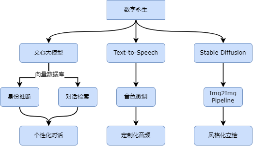


​		数字永生的技术实现路径：

​		（1）**形象生成**：基于开源的SD模型，通过img2img的推理方式，以用户上传的形象照作为参考，生成静态的风格化形象。

​		（2）**对话生成**：基于AI Studio SDK调用文心大模型的能力，从用户上传的对话数据中构建向量数据库，通过向量数据库完成对模仿对象的身份推断和相关段落检索任务，以模拟出已故之人的语气和语言模式，甚至理解亲人的性格和生活经历。

​		（3）**语音合成**：引入现有的paddlespeech语音克隆项目，基于用户上传的音频数据（10段左右）进行微调训练，从而模拟出已故之人的声音。


（8） [基于 LLM的多模态数字人外教](https://aistudio.baidu.com/projectdetail/6767879?channelType=0&channel=0)

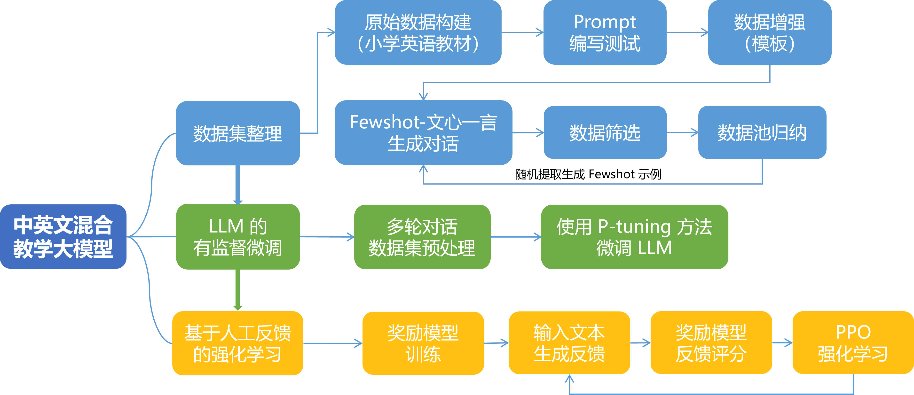

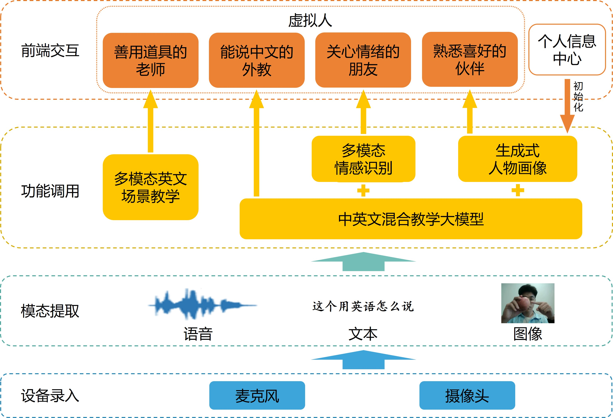


​		机器人的信息采集设备包括麦克风和摄像头，辅以语音识别技术，机器人能够获取与用户相关的图像、语音和文本三个模态的信息。中英文混合教学大模型通过接收语言文本信息，对用户言语做出回应，例如发现句中语法错误等，更能在用户无法听懂英语时成为能说中文的英语外教，以中英文混合的话语指导孩子的英语学 习。多模态英文场景教学通过接收语言文本和视觉图像两个模态的输入，使机器人能够“看图说英文”，从而使其具备了基于实物的英文教学能力，让用户与机器人的交互更加多样化。多模态情感识别依靠接收所有三个模态的输入，实现了对用户情感的分析与识别，从而使大模型的回应更具人情味和亲和力。此外，我们还设计了一套个人知识图谱的生成与动态更新方案，实现了生成式人物画像功能，使智趣 AI 能够成为一个熟悉孩子们习惯、爱好的好伙伴。上述四大功能都统一通过“小智”这一虚拟人形象向用户呈现，从而能更好地提升孩子们与其交互的意愿，增强我们所设计的这款机器人外教的人性化、专业化教学与互动能力。


（9）[wav2lip训练数据预处理综合工具](https://github.com/monk-after-90s/wav2lip_data_preprocess)

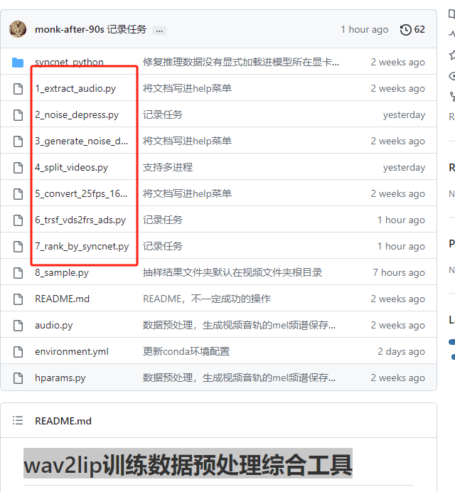


（10）[SadTalker](https://github.com/OpenTalker/SadTalker)

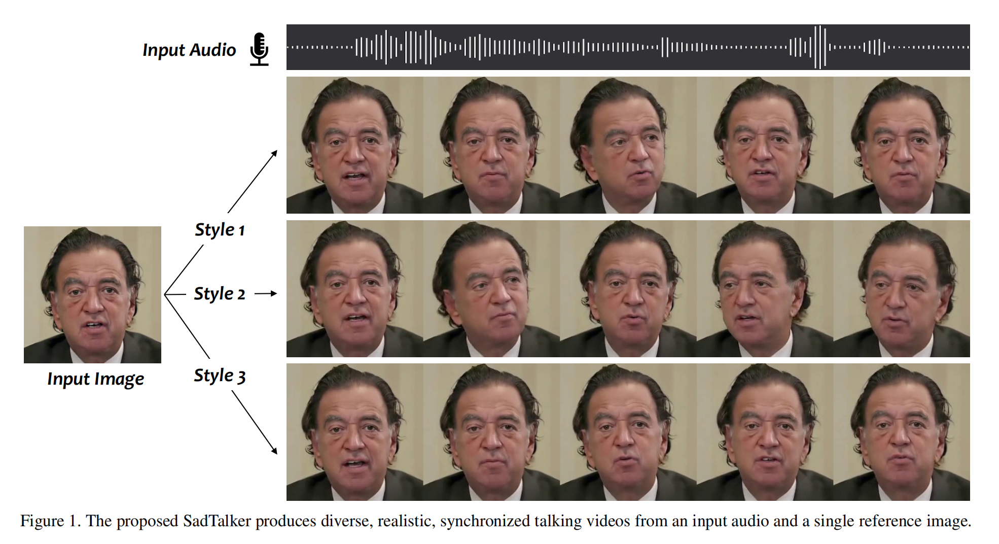

​		该项目对应的论文提出了 SadTalker，能够输入一个图片和一段音频来实现 talking head vedio 的生成。将 3DMM 的 motion coefficient 作为中间表达，通过 ExpNet 和 PoseVAE 来分别生成更真实的表情和 head pose，以得到更真实的 3D 系数。使用更真实的 3D 系数来构建 3D-aware face render，得到更真实的 talking vedio。

​		Talking head 有两种模式，一种是输入语音+图片，还有一种是输入文本+图片，输入文本+图片就需要一个 TextToSpeech 的部件来将文本转换为语音，整体来说 Talking head 就是用语音驱动每一帧图片的表情（眼睛、嘴巴等）和头部（head motion）运动，并重建人脸以生成视频
​		SadTalker 的主要部件如下，下图不是绝对严格的[流程图](https://so.csdn.net/so/search?q=流程图&spm=1001.2101.3001.7020)，只是一个大概的图示例而已。

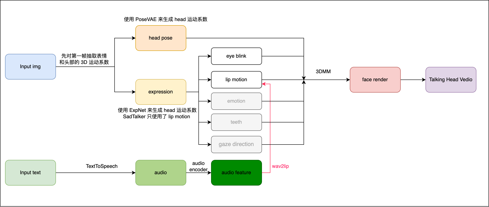


（11）[SadTalker-Video-Lip-Sync](https://github.com/Zz-ww/SadTalker-Video-Lip-Sync)

​		本项目基于SadTalkers实现视频唇形合成的Wav2lip。通过以视频文件方式进行语音驱动生成唇形，设置面部区域可配置的增强方式进行合成唇形（人脸）区域画面增强，提高生成唇形的清晰度。使用DAIN 插帧的DL算法对生成视频进行补帧，补充帧间合成唇形的动作过渡，使合成的唇形更为流畅、真实以及自然。

（12）[ChatGLM + VITS +SadTalker](https://github.com/hhhwmws0117/GLM-VITS-SadTalker)

​			该项目基于清华大学开源模型chatGLM-6B以及vits框架，实现基于大模型数字人项目。模型全文包括参数等存于链接：https://pan.baidu.com/s/1JPsijA4muq8rGsxUykrfrg?pwd=2zot 提取码：2zot

（13）[VideoReTalking](https://github.com/chenxwh/video-retalking)

​			"VideoReTalking" 是一种视频编辑技术，它可以通过分析音频信号来自动生成与语音同步的嘴唇动画。这种技术可以用于创建逼真的虚拟人物，或者在视频编辑中添加语音和嘴唇动画。另一个同名项目https://github.com/OpenTalker/video-retalking#results-in-the-wild-contains-audio


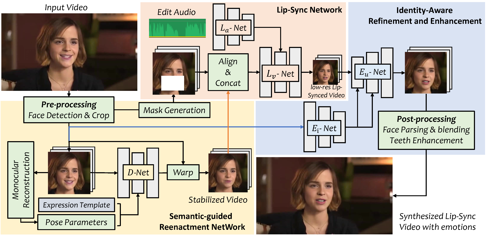

（14）[MyHeyGen](https://github.com/AIFSH/MyHeyGen)

​          一个平民版视频翻译工具，音频翻译，翻译校正，视频唇纹合成全流程解决方案。据说能实现80%的商业效果。autodl上有对应的项目和镜像，详细内容参考：https://www.bilibili.com/read/cv27756185/

## 5.3、哔哩教程

（1）[浪子之心科技](https://space.bilibili.com/431556168/channel/series)

（2） [fay-github](https://space.bilibili.com/2111554564/channel/collectiondetail?sid=1312657)

（3）[MyHeyGen](https://space.bilibili.com/3494358200355206/channel/collectiondetail?sid=1846872)


# 6、参考链接

（1）[数字人，虚拟数字人——你看好数字人领域的发展吗](https://blog.csdn.net/weixin_69553582/article/details/134368839)

（2）[42页|2022年中国虚拟数字人行业研究报告（附下载）](https://zhuanlan.zhihu.com/p/549319483)

（3）[SadTalker使用语音驱动单张图片合成视频（CVPR2023）](https://blog.csdn.net/jiaoyangwm/article/details/132898891)


# 7、备注

​		。。。。更新中
