# FAQ问答资料汇总

# **一、专栏推荐**

## 1.1、[如何搭建基于文本语义的智能问答系统？](https://www.zhihu.com/question/555696715/answer/2736787407)

问答系统大概划分为5个类型：FAQ-Bot、MRC-Bot、KG-Bot、Task-Bot和闲聊。

| 机器人类型 | 知识库结构                                                   | 核心技术          | 落地难度 |
| ---------- | ------------------------------------------------------------ | ----------------- | -------- |
| FAQ-Bot    | {问题:答案}                                                  | 信息检索          | 低       |
| MRC-Bot    | 文档                                                         | 信息检索+机器阅读 | 中       |
| KG-Bot     | [知识三元组](https://www.zhihu.com/search?q=知识三元组&search_source=Entity&hybrid_search_source=Entity&hybrid_search_extra={"sourceType"%3A"answer"%2C"sourceId"%3A2736787407}) | 知识图谱构建/检索 | 高       |
| Task-Bot   | 槽位/对话策略                                                | 对话状态跟踪/管理 | 高       |
| Chat-Bot   | {寒暄语:回复}                                                | 信息检索          | 低       |

​		在上述五种问答系统中比较常用且落地难度较小的就是FAQ。而要搭建FAQ-Bot最快的方式就是通过ES库来构建，基于ES可以快速构建检索型的智能问答系统，包括“输入联想”，“相似问题检索排序”，“拼音/首字母混合检索”等常见功能。传统的ES仅支持“字面”匹配（BM25算法），最新的ES也已经支持“语义”匹配，所以可以通过深度学习模型提取问题的语义特征（例如sentence-bert），然后存入ES中。这样用户的query就可以与问题库进行“字面”匹配+“语义”匹配了。


### 1.1.1、[基于FAQ智能问答之es的调教](https://zhuanlan.zhihu.com/p/347957917)

​		文章主要讲解了es的安装和使用方法，文章中描述mysql与es数据集需要同时发生变化时，可以使用阿里的[canal](https://github.com/alibaba/canal)。文章也介绍了es的检索方式，支持自定义词典等。


### 1.1.2、[基于FAQ智能问答之召回篇](https://zhuanlan.zhihu.com/p/349993294)  

​		本文主要介绍了es召回，语义召回和双路召回三种方式。

​		（1）基于es召回。它本质就是基于BM25的召回，也是基于字面的关键词进行召回，但不是语义的召回。无法解决以下句子的检索。[es操作说明书](https://www.elastic.co/guide/en/elasticsearch/reference/7.16/index-modules-similarity.html)

​			知识库内问题：“可以免运费吗？”

​			用户问题：“你们还包邮？”

​		这两个问题没有一个关键词相同，但是其实是语义一致的。这就需要基于语义的召回来补充关键词召回。

​		（2）基于语义召回。它通常是基于embedding的召回。操作步骤如下：首先训练sentence embedding模型，然后将知识库中的问题都预先计算出embedding向量。在线上预测阶段，对于每个query同样先计算出embedding，再到知识库中检索出相近的embedding所属的问题。

​		（3）双路召回。字面召回 + 语义召回” 的双路召回结构，如下图。

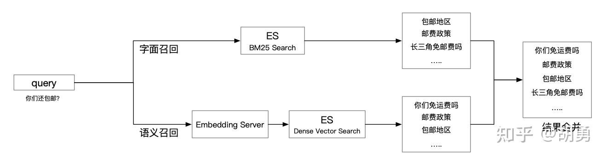

### 1.1.3、[基于FAQ智能问答之精排篇](https://zhuanlan.zhihu.com/p/352316559)

​			给定一个用户的问题q，和一批召回的问题d，对每个d进行相关性的打分计算，并根据相关性进行评价。同时根据top1打分的不同，客户端执行不同的操作：(1) 如果top1的评分"很高"，则直接将答案返回给用户 (2) 如果top1的评分"较高"，则进行问题的推荐 (3) 如果top1的评分"较低"，则提示无法回答。


## 1.2、[Hello NLP专栏](https://www.zhihu.com/column/hellonlp)

### 1.2.1、[对话机器人之闲聊机器人](https://zhuanlan.zhihu.com/p/519181111)

​		闲聊机器人有2个类型，分别是检索式和生成式。本文讲述内容为生成式的闲聊机器人，更准确点说是端到端的生成式聊天机器人。关于端到端的生成方式，确实存在一些问题，例如不可控性，语料成本昂贵，缺乏工业实用性等。但是，优点也很明显，例如可玩性， 生成多样性，发展趋势性等。


### 1.2.2、[对话机器人之任务型对话](https://zhuanlan.zhihu.com/p/560167584)

​		任务型对话有两大类，分别为Pipeline和end-to-end。

- **Pipeline**

> Pipeline 模式非常灵活，可解释性强，易于落地，各个模块都可以采用不同的技术去替换，模块相互之间可以通过参数传递共享上一轮成果。但是其缺点是不够灵活，各个模块之间相对独立，难以联合调优，并且由于模块之间的误差会层层累积。

- **End-to-End**

> End-to-End模式从用户输入到系统输入作为一个整体去训练，训练一个从用户端自然语言输入到机器端自然语言输出的整体映射关系，具有灵活性强、可拓展性高的特点，减少了设计过程中的人工成本，打破了传统模块之间的隔离，也不存在偏置误差，但是中间的模型过于庞大，端到端模型对数据的数量和质量要求很高，训练困难，并且对于填槽、API 调用等过程的建模不够明确，修改任何一个功能，都需要重新训练整个模型。

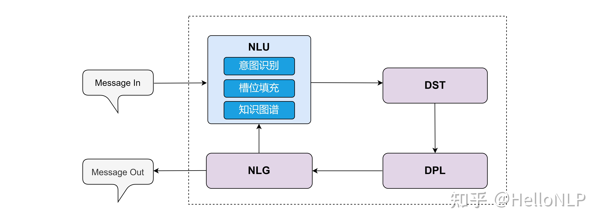

​		在方法应用上，我们采用了Pipeline模式，流程：input->NLU->DST->DPL->NLG->output。其中，在NLU部分，使用了意图识别、槽位填充和知识图谱的方法。NLU -> Natural Language Understanding（自然语言理解）,DST -> Dialogue State Tracker（对话状态跟踪）,DPL -> Dialogue Policy learning（对话策略学习）NLG -> Natural Language Generation（自然语言生成）

### 1.2.3、[对话机器人之事实性问答](https://zhuanlan.zhihu.com/p/562160230)

​		事实型问答（FAQ）是一个检索式问答系统，它对于每一个问题（query）都可以找得到最相似的答案。通常情况下，在给定的标准问题库下，系统将用户输入的问题（query）匹配用户最想问的问题上。在数据库中，存储着大量的问答对，其中每个问题都有固定的答案，同时可能会有多个不同的问法。

​        为了更高效更准确的得到最相似的问题，我们将算法过程分为3个步骤:

1. 第一步通过初筛来减少目标数据集的数量，
2. 第二步通过强匹配看是否可以直接得到结果，如果第二步没有得到结果才会触发第三步，
3. 第三步是通过文本相似度算法直接计算得到结果。

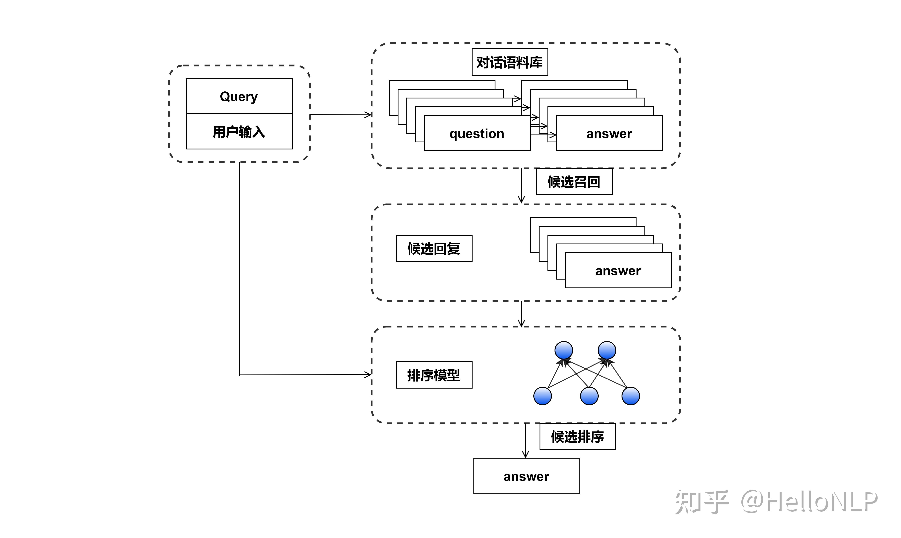


# 二、开源项目

## 2.1、paddle [多路召回项目](https://github.com/PaddlePaddle/PaddleNLP/blob/develop/pipelines/examples/semantic-search/Multi_Recall.md)

本项目提供了低成本搭建端到端两路召回语义检索系统的能力。用户只需要处理好自己的业务数据，就可以使用本项目预置的两路召回语义检索系统模型(召回模型、排序模型)快速搭建一个针对自己业务数据的检索系统，并可以提供 Web 化产品服务。


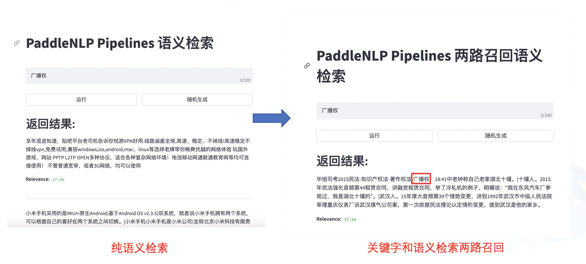


## 2.2、[政务问答系统](https://github.com/PaddlePaddle/PaddleNLP/tree/635b272b64485640f4a5e3fe6c79b0846abc6c84/applications/question_answering/supervised_qa/faq_system)

### 2.2.1、系统架构


## 2.2.2、系统特色

- 低门槛
  - 手把手搭建检索式 FAQ System
  - 无需相似 Query-Query Pair 标注数据也能构建 FAQ System
- 效果好
  - 业界领先的检索预训练模型: RocketQA Dual Encoder
  - 针对无标注数据场景的领先解决方案: 检索预训练模型 + 增强的无监督语义索引微调
- 性能快
  1. 基于 Paddle Inference 快速抽取向量
  2. 基于 Milvus 快速查询和高性能建库
  3. 基于 Paddle Serving 高性能部署

### 2.2.3、效果评估

| 模型                   | Recall@1   | Recall@10  |
| ---------------------- | ---------- | ---------- |
| ERNIE1.0 + SimCSE      | 68.068     | 85.686     |
| RocketQA               | 81.381     | 96.997     |
| RocketQA + SimCSE      | 83.283     | 97.297     |
| RocketQA + SimCSE + WR | **83.584** | **97.497** |


## 2.3、[金融问答系统](https://github.com/PaddlePaddle/PaddleNLP/tree/635b272b64485640f4a5e3fe6c79b0846abc6c84/applications/question_answering/supervised_qa/faq_finance)

### 2.3.1、配套视频链接

​			https://aistudio.baidu.com/aistudio/projectdetail/3882519

### 2.3.2、问答流程


​		如上图所示，问答的流程分为两部分，第一部分是管理员/工程师流程，第二部分就是用户使用流程，在模型的层面，需要离线的准备数据集，训练模型，然后把训练好的模型部署上线。另外，就是线上搭建问答检索引擎，第一步把收集好的语料数据，利用训练好的模型抽取问题的向量，然后把向量插入到近似向量检索引擎中，构建语义索引库，这部分做完了之后，就可以使用这个问答服务了，但是用户输入了Query之后，发生了什么呢？第一步就是线上服务会接收Query后，对数据进行处理，并抽取用户Query的向量，然后在ANN查询模块进行检索匹配相近的问题，最终选取Top10条数据，返回给线上服务，线上服务经过一定的处理，把最终的答案呈现给用户。

### 2.3.3、模型优化流程


### 2.3.4、模型 WR 策略

|      策略      |             举例             |     解释     |
| :------------: | :--------------------------: | :----------: |
|      原句      |   企业养老保险自己怎么办理   |      -       |
| WR策略（Yes）  | 企业养老老保险自己怎么么办理 | 语义改变较小 |
|  随机插入(No)  |  无企业养老保险自己怎么办理  | 语义改变较大 |
| 随机删除（No） |    企业养保险自己怎么办理    | 语义改变较大 |

​		上表是WR策略跟其他策略的简单比较，其中WR策略对原句的语义改变很小，但是改变了句子的长度，破除了SimCSE句子长度相等的假设。WR策略起源于ESimCSE的论文，有兴趣可以从论文里了解其原理。

### 2.4、[多场景对话机器人](https://github.com/charlesXu86/Chatbot_CN)


### 2.5、[FAQ智能问答系统](https://github.com/wzzzd/FAQ_system)

### 2.5.1、知乎文章

​	https://zhuanlan.zhihu.com/p/602337390

### 2.5.2、系统框架

​		系统支持有监督和无监督语义表征训练，也同样支持精排和粗排召回。上述功能均可在配置文件中进行配置。但是目前系统最大的缺点就是系统推理速度很慢，即使使用gpu效果依旧很慢。


### 2.5.3、查询流程

```text
输入query文本 -> 分词 -> 召回（ES） -> 粗序（PreRank） -> 精排（Rank） -> result
```

### 2.5.4、性能指标

​		在100个样本的测试集中，分别统计top1、top3、top10的召回结果准确率。


## 2.6、[简易问答系统demo](https://github.com/lerry-lee/faq-qa-sys)

一个简单的FAQ问答系统实现。基于检索和排序的两阶段框架，检索阶段基于Elasticsearch检索引擎、排序阶段基于语义匹配深度学习模型。后端基于SpringBoot系列框架。

### 2.6.1、系统示意图


### 2.6.2、系统架构图


### 2.6.3、对话流程图


### 2.6.4、多轮对话设计


## 2.7、BEFAQ

​		BEFAQ(BERT-based Embedding Frequently Asked Question)** 开源项目是好好住面向多领域FAQ集合的问答系统框架。我们将Sentence BERT模型应用到FAQ问答系统中。开发者可以使用BEFAQ系统快速构建和定制适用于特定业务场景的FAQ问答系统。

### 2.7.1、BEFAQ优点


（1）使用了Elasticsearch、Faiss、Annoy 作为召回引擎

（2）使用了Sentence BERT 语义向量（Sentence-BERT: Sentence Embeddings using Siamese BERT-Networks）

（3）对同义问题有很好的支持

（4）支持多领域语料（保证了召回的数据是对应领域的，即使是同样的问题，也可以得到不同的答案。）

（5）提供了根据当前输入提示联想问题（suggest）功能的接口


### 2.7.2系统框架

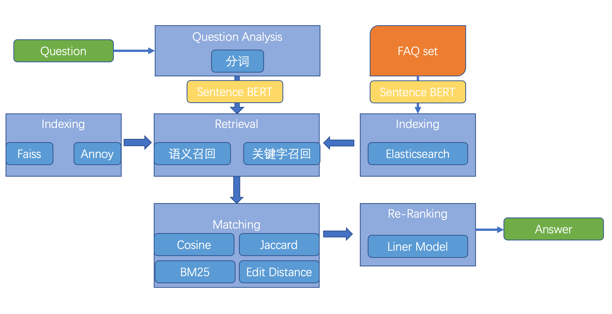


## 三、QA问答系统最新研究

### 3.1、可解释的长篇法律问题回答检索增强的大型语言模型

**Paper：**https://arxiv.org/pdf/2309.17050v1.pdf

**Code：**https://github.com/maastrichtlawtech/lleqa

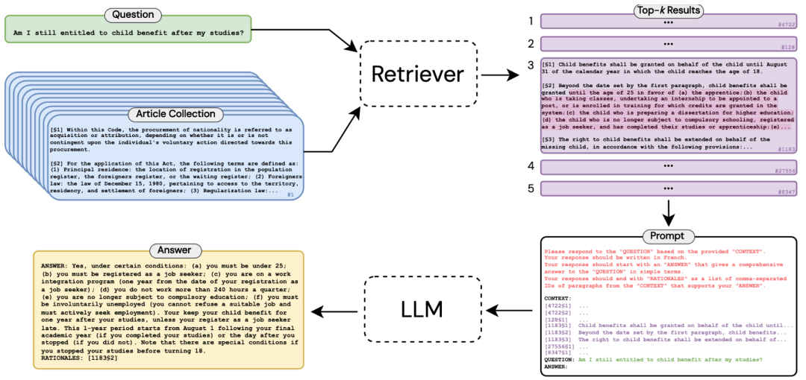

​		本文作者提出了一种端到端的方法，**「旨在利用“先检索后阅读”的管道生成任何成文法问题的长格式答案」**。为了支持这种方法，作者发布了长格式法律问答 (LLeQA) 数据集，其中包含 1,868 个由专家注释的法语法律问题，并包含基于相关法律条款的详细答案。

### 3.2、基于期望最大化证据推理的医学问答解释生成

**Paper：**https://arxiv.org/pdf/2310.01299v1.pdf

​		医疗问答（医疗 QA）系统在协助医护人员寻找问题答案方面发挥着重要作用。然而，仅通过医学 QA 系统提供答案是不够的，因为用户可能需要解释，即用自然语言进行更多分析性陈述，描述支持答案的元素和上下文。

 	为此，本文研究提出了一种新方法，**「为医学 QA 系统预测的答案生成自然语言解释」**。由于高质量的医学解释需要额外的医学知识，因此我们的系统在解释生成过程中从医学教科书中提取知识以提高解释的质量。

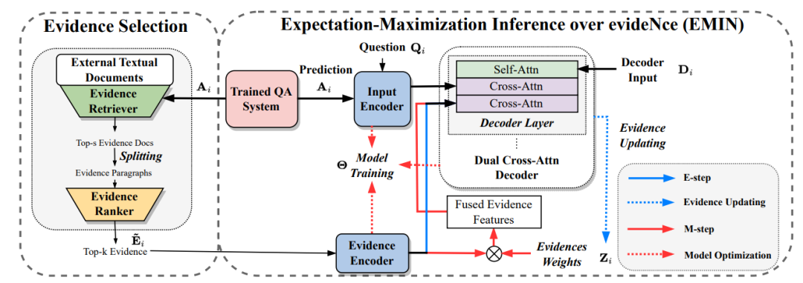

​		作者设计了一种期望最大化方法，可以对这些文本中发现的证据进行推断，提供一种有效的方法来将注意力集中在冗长的证据段落上。在数据集MQAE-diag、MQAE上证明了文本证据推理框架的有效性，并且本文方法优于最先进的模型。

### 3.3、MINPROMPT:基于图形的最小提示数据增强，用于小样本问答

**Paper：**https://arxiv.org/pdf/2310.05007v1.pdf

​		小样本问答（Few-shot QA）旨在少量训练样本的情况下，让模型给出令人满意的回答。最新的研究进展主要依赖大型语言模型（LLM）。尽管预训练阶段已经让LLM具备了强大的推理能力，但LLM仍需要进行微调以适应特定领域，以达到最佳结果。为此，作者建议选择信息最丰富的数据进行微调，从而提高微调过程的效率。

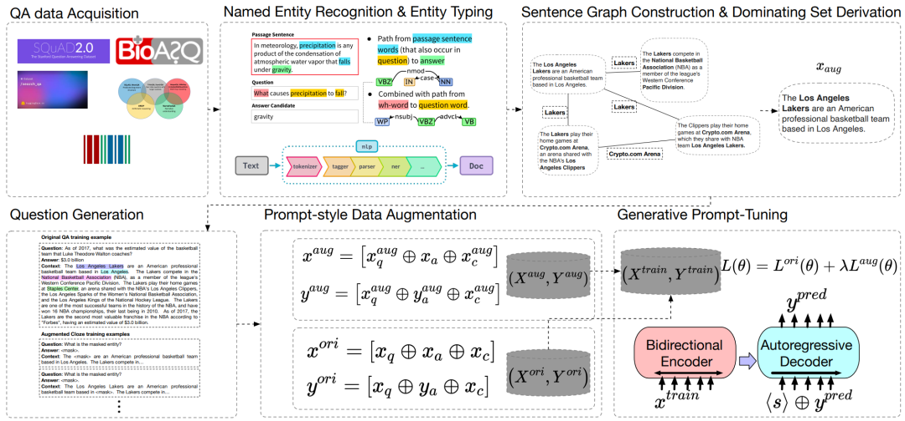

​		本文研究提出了**「MinPrompt」**，一个基于近似图算法和无监督问题生成的开放域QA的最小数据增强框架。作者将原始文本转换为图形结构，以在不同的事实句子之间建立联系，然后应用图形算法来识别原始文本中最多信息所需的最小句子集。然后，根据识别的句子子集生成问答对，并在选定的句子上训练模型以获得最终模型。实证结果表明，MinPrompt 能够以高效率实现与基线相当或更好的结果。


### 3.4、MemSum-DQA:采用高效的长文档抽取摘要器进行文档问答

**Paper：**https://arxiv.org/pdf/2310.06436v1.pdf

**Code：**https://github.com/nianlonggu/MemSum-DQA

 	本文作者提出了**「MemSum-DQA，这是一种高效的文档问答 (DQA) 系统」**，它利用了MemSum（一种长文档提取摘要器），通过在解析文档中的每个文本块中添加所提供的问题和问题类型的前缀，MemSum-DQA 有选择地从文档中提取文本块作为答案。

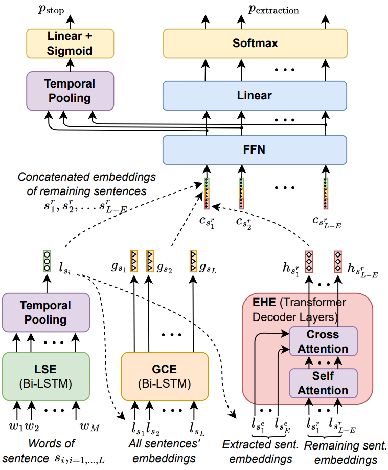

​			在完整文档回答任务中，与之前最先进的基线相比，这种方法的精确匹配精度提高了9%。值得注意的是，**「MemSum-DQA 擅长解决与子关系理解相关的问题」**，强调了提取摘要技术在 DQA 任务中的潜力。


### 3.5、qaddynamics:训练动态驱动的综合QA诊断，用于零样本常识问答

**Paper：**https://arxiv.org/pdf/2310.11303v1.pdf

**Code：**https://github.com/HKUST-KnowComp/QaDynamics

​		Zero-shot常识问答 (QA) 要求模型能够进行一般情况的推理。最先进的方法一般做法是根据常识知识库 (CSKB) 构建的QA对，并对语言模型进行微调，使其能够具备更多的常识知识。但在此过程中，QA对构建过程中可能会引入来自 CSKB 的噪声，从而生成不符合预期的语法问答对，这会阻碍模型的泛化能力。

 	为此，本文提出了**「QADYNAMICS，一种用于QA诊断和改进的动态驱动框架」**。该方法分析了QA对在问答、选项两个方面上的训练动态，通过删除无信息QA对、错误标记、错误选项来简化训练检测组件。大量的实验证明了本文方法的有效性，仅使用33%的合成数据就超过了所有基线模型，其中包括ChatGPT等大模型。并且通过专家评估证实：该框架显着提高了 QA 合成的质量。

### 3.6、Chatkbqa:一个用于知识库问题回答的生成-检索框架

**Paper：**https://arxiv.org/pdf/2310.08975v1.pdf

**Code：**https://github.com/LHRLAB/ChatKBQA

 	知识问答（KBQA）旨在通过检索大型知识库（KB）得出问题答案，该研究通常分为两个部分：知识检索和语义解析。但是目前KBQA仍然存在3个主要挑战：知识检索效率低下、检索错误影响语义解析结果以及先前KBQA方法的复杂性。在大型语言模型 (LLM) 时代，作者引入了**「ChatKBQA，这是一种新型生成再检索KBQA 框架」**，它建立在微调开源LLM的基础上，例如 Llama-2、ChatGLM2 和 Baichuan2。

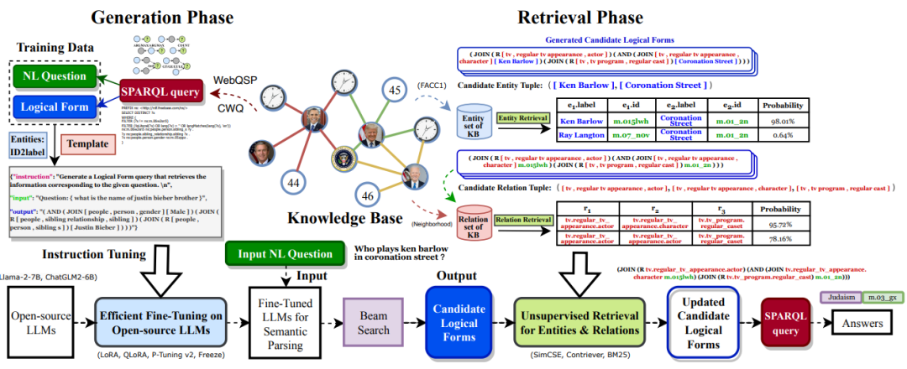

​		ChatKBQA提出首先使用微调的LLM生成逻辑形式，然后通过无监督检索方法检索和替换实体、关系，这直接地改进了生成和检索。实验结果表明，ChatKBQA在标准KBQA数据集、WebQSP和ComplexWebQuestions (CWQ)上实现了最先进的性能。本文研究还提供了一种将LLMs与知识图谱（KG）相结合的新范式，以实现可解释的、基于知识的问答。


## 四、经典算法

## 4.1、[BM25](https://zhuanlan.zhihu.com/p/499906089)

​		文本匹配包括监督学习方法以及非监督学习方法。或者分为传统方法和深度学习方法。传统的非监督学习方法有：Jaccard，Levenshtein（编辑距离），Simhash，BM25，VSM（向量空间）等，最具代表的算法当属BM25。其在著名的搜索解决方案Elastic中就有相关的使用。

原文：https://mp.weixin.qq.com/s/A4OOmG6YTL0ga6rarNoiwA

源码：
		(1)https://www.jianshu.com/p/1e498888f505

​		(2)https://github.com/zhusleep/fastbm25


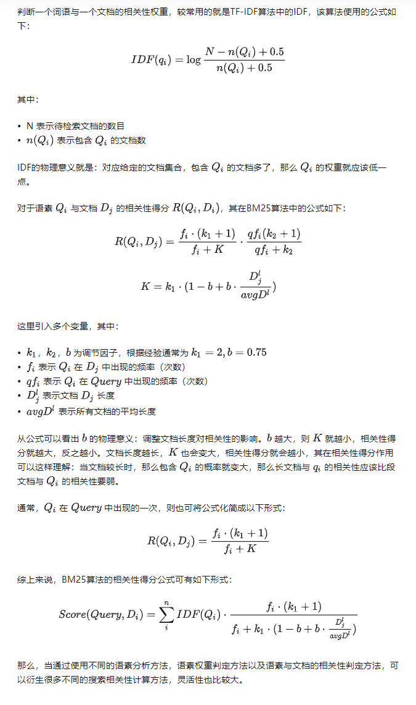

## 4.2、[simcse](https://zhuanlan.zhihu.com/p/368353121)

**论文:** **[SimCSE: Simple Contrastive Learning of Sentence Embeddings](https://link.zhihu.com/?target=https%3A//arxiv.org/abs/2104.08821)**

**源码:** **[princeton-nlp/SimCSE](https://link.zhihu.com/?target=https%3A//github.com/princeton-nlp/SimCSE)**

​		SimCSE 将对比学习（Contrastive Learning）的思想引入到了文本匹配中。对比学习的核心思想就是：将相似的样本拉近，将不相似的样本推远。


### 4.2.1、[simcse原理](https://www.zhihu.com/question/526288696/answer/2848119153)

​		SimCSE 将对比学习（Contrastive Learning）的思想引入到了文本匹配中。对比学习的核心思想就是：将相似的样本拉近，将不相似的样本推远。但现在问题是：我们没有标注数据，怎么知道哪些文本是相似的，哪些是不相似的呢？

​		SimCSE 相出了一种很妙的办法，由于预训练模型在训练的时候通常都会使用 **dropout** 机制。这就意味着：即使是同一个样本过两次模型也会得到两个不同的 embedding。而因为同样的样本，那一定是相似的，模型输出的这两个 embedding 距离就应当尽可能的相近；反之，那些不同的输入样本过模型后得到的 embedding 就应当尽可能的被推远。


### 4.2.2、 SimCSE 缺点

从 SimCSE 的正例构建中我们可以看出来，所有的正例都是由「同一个句子」过了两次模型得到的。这就会造成一个问题：模型会更倾向于认为，长度相同的句子就代表一样的意思。由于数据样本是随机选取的，那么很有可能在一个 batch 内采样到的句子长度是不相同的。

对于它的缺点解决方案就是Esimces


## 五、数据清洗：

​       (1) 去除重复项。检查数据集中是否有重复的问题或答案，如果有，只保留一份。

​       (2) 格式一致。确保所有的问题和答案都是以相同的格式储存的，规范数据集格式一致。

​      (3) 去除无关项。如果数据集中包含了与你的项目无关的问题或答案，你应该将它们去除。

​      (4) 语言清洗。去除文本中的拼写错误，语法错误，使用统一的词汇和表达方式。

​     (5) 数据填充。如果某些重要的问题或答案缺失了，你可能需要填充它们。

​     (6) 数据分割。对于FAQ数据集，可能需要将问题和答案分开，存储在不同的列或者数据结构中。

## 六、数据集

（1）[m3e数据集链接](https://pan.baidu.com/s/1KHOWZ7OM9_BrWFyVT7c6xg?pwd=x609 ) 

（2）[FAQ数据集调研](https://zhuanlan.zhihu.com/p/83211462)

（3）[SimCSE 实战数据集](https://zhuanlan.zhihu.com/p/634871699)


## 七、主要参考资料：

​	1、[如何搭建基于文本语义的智能问答系统？](https://www.zhihu.com/question/555696715/answer/2736787407)

​	2、https://huggingface.co/moka-ai/m3e-large

​	3、https://milvus.io/docs/v1.1.1/milvus_docker-cpu.md

​	4、https://www.zhihu.com/question/555696715/answer/2736787407

​	5、https://zhuanlan.zhihu.com/p/347957917

​	6、https://zhuanlan.zhihu.com/p/352316559

​	7、https://github.com/PaddlePaddle/PaddleNLP/blob/develop/pipelines/examples/semantic-search/Multi_Recall.md

​	8、[paddle-nlp faq_system](https://github.com/PaddlePaddle/PaddleNLP/tree/635b272b64485640f4a5e3fe6c79b0846abc6c84/applications/question_answering/supervised_qa/faq_system)

​	9、[paddle-nlp _faq_finance](https://github.com/PaddlePaddle/PaddleNLP/tree/635b272b64485640f4a5e3fe6c79b0846abc6c84/applications/question_answering/supervised_qa/faq_finance)

​	10、https://github.com/wzzzd/FAQ_system

​	11、https://github.com/lerry-lee/faq-qa-sys

​	12、https://www.elastic.co/cn/blog/text-similarity-search-with-vectors-in-elasticsearch

​	13、https://www.zhihu.com/column/hellonlp

​	14、https://www.zhihu.com/question/526288696/answer/2848119153

​	15、https://mp.weixin.qq.com/s/YDrPFMnG1ekNyNNq3ea7Iw
